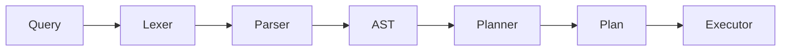

In the previous parts of this series, we've focused on the **syntax** of a query—how to break a string into tokens and how to validate those tokens against a grammar to build an Abstract Syntax Tree (AST).

But a database doesn't "execute" an AST. An AST is a linguistic structure; it represents how the query was written. To run the query, we need to understand what it **means** algebraically.

This part covers the transition: **From Syntax to Algebra**.

### The Transition: AST vs. Logical Plan

The AST is **syntactic**. It captures the structure of the SQL statement, keeping track of things like keywords, commas, and parentheses. It is a faithful representation of the user's input.

The Logical Plan is **algebraic**. It represents the query as a tree of relational operators. It moves us away from SQL syntax and into relational transformations over data sets.

| Feature | Abstract Syntax Tree (AST) | Logical Plan |
| :--- | :--- | :--- |
| **Focus** | How the query is written (Syntax) | Algebraic interpretation of the query |
| **Form** | Hierarchical representation of tokens | Tree of relational operators |
| **Goal** | Validation and structural analysis | Execution and optimization |

### Why the AST Is Not Enough

Consider a simple query:
```sql
SELECT id FROM users WHERE age > 30;
```

The AST for this query is a tree that says: "There is a Select node. It has a projection list with `id`, a source `users`, and a filter condition `age > 30`."

However, an execution engine needs a structured representation of the relational transformations involved:
1.  **Scan** the `users` table.
2.  **Filter** the resulting rows where `age > 30`.
3.  **Project** only the `id` column.

The :h[AST captures the structure of the query, but the Logical Plan describes the sequence of relational transformations required to evaluate it.]

### Introducing Relational Algebra

The Logical Plan is built using the building blocks of **Relational Algebra**. Don't let the name intimidate you; in the context of a query engine, these are simply operations that take one or more relations (tables/data sets) as input and produce a new relation as output.

In [Relop](https://github.com/SarthakMakhija/relop), we focus on a core set of operators:

*   **Scan:** The base operator that reads rows from a table.
*   **Selection:** Also known as **Filter**. It picks rows that satisfy a predicate (e.g., `age > 30`).
*   **Projection:** Selects specific columns from a relation (e.g., just the `id`).
*   **Join:** Combines two relations based on a condition.
*   **Sort / Limit:** Auxiliary operators for ordering and truncating the result set.

### The Logical Plan Tree

In code, we represent `LogicalPlan` as a recursive `enum`. Each node in the tree holds a reference to its child (the `base_plan`), creating a "chain" of operations:

```rust
pub(crate) enum LogicalPlan {
    /// Plan to scan a table.
    Scan {
        table_name: String,
        alias: Option<String>,
    },
    /// Plan to perform a join between two tables.
    Join {
        left: Box<LogicalPlan>,
        right: Box<LogicalPlan>,
        on: Option<Predicate>,
    },
    /// Plan to project specific columns from a base plan.
    Projection {
        base_plan: Box<LogicalPlan>,
        columns: Vec<String>,
    },
    /// Plan to filter results based on a predicate.
    Filter {
        base_plan: Box<LogicalPlan>,
        predicate: Predicate,
    },
    /// Plan to limit results.
    Limit {
        base_plan: Box<LogicalPlan>,
        count: usize,
    },
    /// Plan to order the results.
    Sort {
        base_plan: Box<LogicalPlan>,
        ordering_keys: Vec<OrderingKey>,
    },
    // ... ShowTables, DescribeTable
}
```

> Unary operators (Filter, Projection, Limit, Sort) have a single child, while binary operators (Join) have two.

For the query `SELECT id FROM users WHERE age > 30`, the logical tree looks like this:

```text
Projection(id)
    └── Filter(age > 30)
        └── Scan(users)
```

Conceptually, data flows from the leaves (Scan) upward toward the root. The `Scan` produces rows (via `Iterator`), which flows into the `Filter`, which then flows into the `Projection`. :h[Although a logical plan resembles a sequence of steps, it is still declarative. It describes data flow dependencies, not physical execution order.]

### Mapping AST ──▶ Logical Plan

The component responsible for this transformation is the **Planner**. It traverses the AST and "lowers" it into the algebraic structure. 

In Relop, this is handled by `LogicalPlanner`:

```rust
pub(crate) struct LogicalPlanner;

impl LogicalPlanner {
    /// Converts an Ast into a LogicalPlan.
    /// The hierarchy is: Scan → Filter → Projection → Sort → Limit
    pub(crate) fn plan(ast: Ast) -> Result<LogicalPlan, PlanningError> {
        match ast {
            Ast::Select {
                source,
                projection,
                where_clause,
                limit,
                order_by,
            } => {
                // 1. Start with the source (Scan or Join)
                let base_plan = Self::plan_for_source(source)?;
                
                // 2. Wrap it in a Filter if WHERE exists
                let base_plan = Self::plan_for_filter(where_clause, base_plan)?;
                
                // 3. Wrap it in a Projection
                let base_plan = Self::plan_for_projection(projection, base_plan);
                
                // 4. Layer on Sort and Limit
                let base_plan = Self::plan_for_sort(order_by, base_plan);
                Ok(Self::plan_for_limit(limit, base_plan))
            }
            // ... ShowTables, DescribeTable mapping
        }
    }

    fn plan_for_source(source: TableSource) -> Result<LogicalPlan, PlanningError> {
        match source {
            TableSource::Table { name, alias } => {
                Ok(LogicalPlan::Scan { table_name: name, alias })
            }
            TableSource::Join { left, right, on } => {
                Ok(LogicalPlan::Join {
                    left: Self::plan_for_source(*left)?.boxed(),
                    right: Self::plan_for_source(*right)?.boxed(),
                    on: on.map(Predicate::try_from).transpose()?,
                })
            }
        }
    }

    fn plan_for_filter(
        where_clause: Option<WhereClause>,
        base_plan: LogicalPlan,
    ) -> Result<LogicalPlan, PlanningError> {
        if let Some(clause) = where_clause {
            return Ok(LogicalPlan::Filter {
                base_plan: base_plan.boxed(),
                predicate: Predicate::try_from(clause)?,
            });
        }
        Ok(base_plan)
    }
    // ... plan_for_projection, etc.
}
```

#### How the Planner Works

1.  **Bottom-Up Construction**: Although the SQL statement starts with `SELECT`, the planner builds the plan from the "leaves" (the data source) upwards. Notice that the planner reverses the surface structure of SQL. Although the query begins with SELECT, the logical plan begins with the data source.
2.  **Conversion**: It converts syntactic expressions (from the AST) into logical **Predicates**. While the AST's `Expression` enum is about nested logic, a `Predicate` is about something that can be evaluated against a row.
3.  **Strict Hierarchy**: The planner enforces a standard order (Scan → Filter → Projection). This ensures that the later stages (like Projection) have access to all the columns they might need from the earlier stages.

The `LogicalPlanner` in Relop is available [here](https://github.com/SarthakMakhija/relop/blob/main/src/query/plan/mod.rs#L74).

### AST vs. Logical Plan: A Visual Comparison

Let's look at how the same query is represented in both worlds:

```text
QUERY: SELECT name FROM users WHERE id = 1

AST (Syntax)                     Logical Plan (Algebra)
────────────────────────────     ─────────────────────────────────
Select {                         Projection(name)
  source: "users",                 └── Filter(id = 1)
  projection: ["name"],                └── Scan(users)
  where: Comparison(id = 1)
}
```

The AST is a data structure defining **what the user said**. The Logical Plan is a tree defining how relations are transformed and combined.

### Logical Plan as an Intermediate Representation (IR)

This layer is often referred to as an **Intermediate Representation (IR)**. By decoupling the parser from the executor, we gain a massive advantage: **Optimization**.

Since the Logical Plan is an algebraic tree, we can perform "Tree Rewrites" before execution. These rewrites preserve logical equivalence while improving performance. This is where most of the "smarts" of a database live:

*   **Predicate Pushdown**: If we have a filter, can we move it closer to the `Scan` to read fewer rows?
*   **Projection Pruning**: If we only need the `name`, can we tell the `Scan` to ignore all other columns early?
*   **Join Reordering**: If we are joining three tables, which order will involve the smallest intermediate results?

Even in a minimal engine like Relop, having this IR is the foundation for turning a static query into a high-performance execution.

### Conclusion

The transition from a syntactic AST to an algebraic Logical Plan is the moment a query engine stops thinking about "strings" and starts thinking about "data." 



_(Note: Relop does not implement a cost-based optimizer or a separate physical planning phase.)._

We've crossed the bridge from language into the world of relational operators. With a Logical Plan in hand, we have a clear recipe for execution. In the final part of this series, we will look at the **Executor**: the component that takes this plan and turns it into a living stream of rows.
