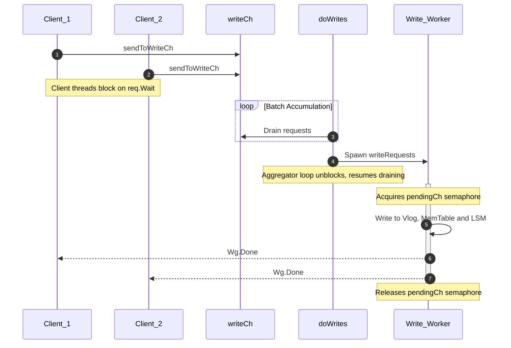

When building or analyzing high-performance storage engines, one of the most critical engineering challenges is coordinating concurrent client threads across the boundaries of volatile memory (RAM) and non-volatile storage (disk). If every client thread manages its own lock acquisition and performs synchronous disk I/O, the storage engine quickly succumbs to thread contention, excessive context switching, and low throughput.

To solve this, modern engines like Badger, RocksDB, and Pebble employ highly optimized concurrency pipelines on their ingest paths. Rather than utilizing naive locking, they decouple batch accumulation from physical write execution.

In this article, we explore the first major pattern of write path concurrency: **The Pipelined Batch Aggregator**, as implemented by Dgraph's [BadgerDB](https://github.com/dgraph-io/badger).

---

### Pattern 1: Pipelined Batch Aggregator (Badger’s Pattern)

#### The Problem

In a write-heavy storage engine, concurrent client threads continuously issue mutations (e.g., `Put` or `Delete`). However, at the bottom of the stack lies a harsh hardware constraint: the disk boundary is a strict, single-lane bottleneck. Because sequential disk lines cannot handle concurrent interleaving bytes without data corruption, absolute write serialization at the physical file descriptor is mathematically unavoidable.

The core challenge of storage engine architecture is deciding where and how concurrent client threads should wait for this serialized disk boundary.

In a naive architecture, the engine guards the write path using a direct mutual exclusion primitive (such as a standard `sync.Mutex`). Under heavy write pressure, this approach introduces two crippling architectural flaws:

**Kernel-Level Thread Thrashing**: It forces concurrent client threads to block directly on OS-level primitives. When writes are highly contested, the CPU wastes massive cycles on context-switching and thread scheduling overhead as threads are constantly put to sleep and woken up.

**Blocking the Ingestion Gate**: If the thread responsible for collecting incoming transactions also executes the heavy physical disk I/O sequentially, the engine completely loses its elasticity. While a batch is waiting for a slow disk fsync to complete, the ingestion gate is locked. The engine cannot accept new writes, leverage multi-core parallelism, or utilize fast memory buffers to mask the slow realities of the physical storage layer.

To scale under high concurrency, the engine must separate batch accumulation from the execution of physical disk I/O.

#### The Solution

**Pipelined Batch Aggregator**: It means **client threads do not perform any database writes themselves**. Instead:
1. Client threads package their write requests and send them into a thread-safe, in-memory queue.
2. A dedicated background **accumulator loop** drains this queue and groups incoming requests into a single batch.
3. Once a batch is ready, the accumulator loop hands it off to a **separate, serialized write worker** that writes it to the Value Log (vlog), WAL, and MemTable.
4. Because the write execution is handed off, the accumulator loop is immediately unblocked to resume draining the queue and building the next batch in parallel, protecting the client threads from write latency.

#### Badger's Code

Badger implements this pattern using Go's channel mechanics. When a transaction is committed, its entries are sent to the database's write channel via the `sendToWriteCh` function.

```go
func (db *DB) sendToWriteCh(entries []*Entry) (*request, error) {
	//Code removed for brevity.
	req := requestPool.Get().(*request)
	req.reset()
	req.Entries = entries
	req.Wg.Add(1)
	db.writeCh <- req // [!code highlight]
	y.NumPutsAdd(db.opt.MetricsEnabled, int64(len(entries)))

	return req, nil
}
```

The background goroutine running `doWrites` serves as the **singular batch aggregator** where **incoming requests are batched** in memory. It coordinates batch accumulation and handles the hand-off to the write processor.

```go
func (db *DB) doWrites(lc *z.Closer) {
	defer lc.Done()
	pendingCh := make(chan struct{}, 1)

	writeRequests := func(reqs []*request) {
		if err := db.writeRequests(reqs); err != nil {
			db.opt.Errorf("writeRequests: %v", err)
		}
		<-pendingCh
	}

	reqs := make([]*request, 0, 10)
	for {
		var r *request
		select {
		case r = <-db.writeCh:

		for {
			reqs = append(reqs, r)		 	//batching
			reqLen.Set(int64(len(reqs)))

			if len(reqs) >= 3*kvWriteChCapacity {
				pendingCh <- struct{}{} 	      //write serialization
				goto writeCase
			}
			// Note: Continuous non-blocking polling of db.writeCh 
               // and pendingCh slot availability removed for brevity.
		}

		writeCase:
			go writeRequests(reqs)
			reqs = make([]*request, 0, 10)
			reqLen.Set(0)
		}
	}
}
```

#### The Write Serialization Mechanism (`pendingCh`)

To prevent multiple concurrent write workers from writing to the disk out of order, Badger uses a synchronization channel named `pendingCh` with a capacity of **1**:

* **Acquiring the Write Lock**: Before launching a background writer goroutine (`go writeRequests(reqs)`), the aggregator sends a token into the channel: `pendingCh <- struct{}{}`. If a previous write worker is still running, this send will block, parking the aggregator loop and preventing a second write worker from spawning.
* **Eager Flushes**: If the number of accumulated requests becomes too large (`len(reqs) >= 3 * kvWriteChCapacity`), Badger doesn't wait for the standard loop; it immediately blocks until it can acquire the write lock (`pendingCh <- struct{}{}`) and jumps to trigger the flush (`goto writeCase`).
* **Releasing the Lock**: Once the active write worker completes `db.writeRequests(reqs)`, it drains a token from the channel: `<-pendingCh`. This immediately unblocks the aggregator loop, allowing it to spawn the next write worker.

`doWrites` is available [here](https://github.com/dgraph-io/badger/blob/main/db.go#L943).

#### Visualizing the Pipeline



#### The Invariant Control

To prevent data corruption from concurrent file descriptor writes, the execution slot is guarded by the **concurrency gate** `pendingCh := make(chan struct{}, 1)`.

This design creates two core invariant controls:

1. **Strict Write Serialization**: While request accumulation is non-blocking and fluid, writing `pendingCh <- struct{}{}` before launching `go writeRequests(reqs)` guarantees that exactly one write execution block is actively hitting the disk and memory layers at any given timestamp. The token is released in `writeRequests` via `<-pendingCh` only after the disk write successfully completes.
2. **Self-Regulating Backpressure**: If the underlying disk I/O becomes saturated and writes slow down, the `pendingCh` semaphore remains filled. As a result, the `doWrites` loop blocks at `pendingCh <- struct{}{}` when trying to flush. This blockage halts the consumption of `db.writeCh`, causing it to fill up. Once `db.writeCh` is saturated, client threads calling `sendToWriteCh` will naturally block on the channel send (`db.writeCh <- req`), dynamically matching the client ingestion rate to the physical limits of the storage hardware without crashing the runtime.
