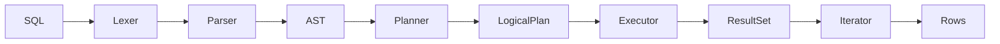

In the last part, we saw how the [Logical Plan](/en/blog/inside_a_query_engine_logical_plan) acts as a blueprint for our query. It is a static tree that describes *what* relational transformations must happen to the data.

This final part is about the **Executor**: the component that takes that blueprint and turns it into living, breathing code.

_(Note: Relop does not implement a cost-based optimizer or a separate physical planning phase. The Executor works on the LogicalPlan directly.)_

### From Logical Plan to Running Code

The boundary between planning and execution is clear:
- The **Logical Plan** is descriptive. It is an algebraic tree of what we want to achieve.
- The **Executor** turns each logical operator into executable code.
- The **Logical Plan** is a tree of descriptions; the **Executor** transforms it into a tree of iterator factories.

When we move from the plan to the executor, we aren't just traversing a tree; we are building a stack of **iterators** that will pull data through the system.

This "realization" happens recursively. The executor looks at a logical plan node, creates the corresponding execution operator (called `ResultSet`), and then recursively does the same for its children. 

Here is how the core `execute_select` logic looks in Relop:

```rust
fn execute_select(
    &self,
    logical_plan: LogicalPlan,
) -> Result<Box<dyn result_set::ResultSet>, ExecutionError> {
    match logical_plan {
        LogicalPlan::Scan { table_name, alias } => {
            let (table_entry, table) = self
                .catalog
                .scan(table_name.as_ref())
                .map_err(ExecutionError::Catalog)?;

            let table_scan = table_entry.scan();
            Ok(Box::new(result_set::ScanResultsSet::new(
                table_scan, table, alias,
            )))
        }
        LogicalPlan::Join { left, right, on } => {
            let left_result_set = self.execute_select(*left)?;
            let right_result_set = self.execute_select(*right)?;
            Ok(Box::new(result_set::NestedLoopJoinResultSet::new(
                left_result_set,
                right_result_set,
                on,
            )))
        }
        LogicalPlan::Filter { base_plan: base, predicate } => {
            let result_set = self.execute_select(*base)?;
            Ok(Box::new(result_set::FilterResultSet::new(
                result_set, predicate,
            )))
        }
        LogicalPlan::Projection { base_plan: base, columns } => {
            let result_set = self.execute_select(*base)?;
            let project_result_set =
                result_set::ProjectResultSet::new(result_set, &columns[..])?;
            Ok(Box::new(project_result_set))
        }
        // ... handled similarly for Sort, Limit, etc.
    }
}
```

In this code, you can see the **Recursive Construction**. To execute a `Filter`, we first execute its `base_plan`. This recursion continues until we reach a `Scan`, which hits the catalog and provides the actual data source. 

The result is a tree of `ResultSet` objects that perfectly mirrors our `LogicalPlan`, but where each node is now a piece of code ready to iterate over rows.

### The Execution Model: Pull-Based (Volcano Model)

[Relop](https://github.com/SarthakMakhija/relop/blob/main/src/query/executor/mod.rs) uses a **pull-based iterator model**, also known as the **Volcano Model**. 

In this model, execution begins at the **root** of the logical plan, the top-most operator in the tree (for example, the Projection in a `SELECT` query). When the client requests a row by calling `next()` on the root iterator, that `iterator` pulls from its child iterator. This cascading chain continues downward until a row is produced by the base data source (the `table scan`), after which the row flows back up through each layer to the client.

Let's take an example.

```SQL
SELECT id
FROM users
WHERE age > 30;
```

The above query produces the following logical plan:

```text
Projection(columns = ["id"])
    └── Filter(predicate = age > 30)
            └── Scan(table = "users")
```

```rust
LogicalPlan::Projection {
    columns: vec!["id"],
    base_plan: Box::new(
        LogicalPlan::Filter {
            predicate: age > 30,
            base_plan: Box::new(
                LogicalPlan::Scan {
                    table_name: "users",
                    alias: None,
                }
            )
        }
    )
}
```

When the Executor runs, it **mirrors** this **tree** with **concrete operator implementations**:

```text
SQL:
SELECT id FROM users WHERE age > 30;

────────────────────────────────────────────────────────────

Logical Plan (Descriptive)        ResultSet Tree (Executable)

Projection                        ProjectResultSet
  └── Filter                        └── FilterResultSet
        └── Scan                          └── ScanResultsSet

────────────────────────────────────────────────────────────
```

When the user calls `next()` on the root iterator, the following happens:

1. The `Projection ResultSet` calls `next()` on its child iterator (the `Filter`).
2. The `Filter` operator calls `next()` on its child iterator (the `Scan`).
3. The `Scan` operator reads a row from the table.
4. The `Filter` operator checks if the row satisfies the predicate.
5. If the row satisfies the predicate, the `Projection` operator projects the row and returns it.

### ResultSet: Why It Is Not an Iterator

One of the most critical design decisions in Relop is the distinction between a `ResultSet` and an `Iterator`.

You might expect an operator to *be* an iterator, but in Relop, an operator *implements* `ResultSet`.

```rust
pub trait ResultSet: Send + Sync {
    /// Returns an iterator over the rows in the result set.
    fn iterator(&self) -> Result<Box<dyn Iterator<Item = RowViewResult> + '_>, ExecutionError>;

    /// Returns the schema of the result set.
    fn schema(&self) -> &Schema;
}
```

Why this extra layer?

1.  **Ownership Boundaries**: The `ResultSet` owns the structural data (like the schema or filter predicate), while the `Iterator` holds the transient execution state (like the current row cursor).
2.  **Multiple Passes**: Because `ResultSet` is a factory, you can call `.iterator()` multiple times to restart the execution without rebuilding the entire plan.
3.  **Self-Referential Safety**: In Rust, keeping the iteration state separate from the data source avoids complex lifetime and self-referential struct issues.

### Unary Operators: Decorators Over ResultSet

The implementation of most operators follows a simple pattern: they are **decorators**. Every operator wraps another `ResultSet` and transforms the iterator it produces.

Consider the `FilterResultSet`:

```rust
pub struct FilterResultSet {
    inner: Box<dyn ResultSet>,
    predicate: Predicate,
}

impl ResultSet for FilterResultSet {
    fn iterator(&self) -> Result<Box<dyn Iterator<Item = RowViewResult> + '_>, ExecutionError> {
        let inner_iterator = self.inner.iterator()?;
        // The transformation happens here
        Ok(Box::new(inner_iterator.filter(|row| {
           // check predicate...
        })))
    }
}
```

By stacking these decorators **`Limit` → `Sort` → `Projection` → `Filter` → `Scan`**, we form an execution pipeline where the `Scan` operator sits at the very base, providing the source data for the layers above. Each layer wraps the previous one, and data flows through them like a stream.

Each operator transforms the row in a specific way:

- **Scan** produces the initial `RowView` from raw table data.
- **Filter** evaluates a `Predicate` against the `RowView`. This is where the logical expressions we parsed earlier finally become executable code.
- **Projection** rewrites the `RowView` by restricting which columns are visible, effectively narrowing the schema without copying the underlying row.
- **Sort** may buffer many `RowViews` in memory before reordering them.
- **Limit** simply truncates the stream after a fixed number of rows.

Notice that no operator needs to know how the row was originally produced. Each layer only sees a `RowView` coming from below and returns a transformed `RowView` to its parent. This isolation is what makes the pipeline composable.

### Nested Loop Join: The Binary Operator

While unary operators are simple decorators, the **Join** is a bit more complex. It is a binary operator that must coordinate two different `ResultSet` sources. In Relop, joins are left-associative.

Relop implements a [Nested Loop Join](https://github.com/SarthakMakhija/relop/blob/main/src/query/executor/result_set.rs#L292). For a join between table A and table B, the logic is:
1.  Pull a row from A (the outer table).
2.  Reset the iterator for B (the inner table) and pull every row from it.
3.  Combine the current A row with each B row and evaluate the join condition.
4.  Repeat for every row in A.

Each join node only understands its immediate children; recursion composes them into arbitrarily deep join trees.
For multi-table joins like `(A JOIN B) JOIN C`, this execution forms a recursive tree of iterators:

```text
           [Outer Join Iterator]
              /            \
     left_iterator: Pulls  right_result_set: Resets and iterates
     rows from Inner Join  for every left row.
            /
    [Inner Join Iterator]
       /            \
  left: Pulls from A  right: Resets/Iterates for B
```

#### The Recursive Execution Flow

The elegance of the Volcano model is that the "Outer" join doesn't need to know it is pulling from another join; it just sees a stream of rows from its `left_iterator`.

1.  The **Outer Join Iterator** calls `next()` on its `left_iterator` (the Inner Join).
2.  The **Inner Join Iterator** pulls a row from `A`, resets `B`, and returns the first `A+B` combined row.
3.  The **Outer Join Iterator** receives `A+B`, resets its own right side (`C`), and begins combining `A+B` with each row of `C`.
4.  This process repeats, effectively creating a 3-level deep nested loop without the outer nodes needing to know the internal structure of their children.

This recursive "reset and iterate" pattern allows Relop to handle arbitrarily complex join trees using a single, unified join operator implementation.

### Data Flow: RowView and Predicates

As rows flow through this pipeline, they are wrapped in a **RowView**. This is a lightweight structure that allows operators to access column values without constantly copying data.

- **Filters** evaluate `Predicates` against a `RowView`. This is where the logical expressions we parsed in Part 4 finally come to life.
- **Projections** rewrite the `RowView` to hide columns that aren't needed.
- **Joins** merge two `RowViews` into a single combined view before evaluating the `ON` condition.

### Blocking vs. Streaming Operators

In a pull-based model, there are two types of operators:

1.  **Streaming Operators**: These yield rows as soon as they receive them from their child. `Filter`, `Projection`, and `Limit` are streaming. They have a very low memory footprint because they don't store rows.
2.  **Blocking Operators**: These must consume **all** input from their child before they can yield the first result. `Sort` (`OrderingResultSet`) is a prime example. To sort the data, the engine must buffer the entire input set into memory, sort it, and only then start yielding rows to the parent. **Blocking operators** break the pure streaming pipeline and introduce memory buffering.

This distinction is fundamental to understanding the performance and memory profile of a query.

### The Full Model in Action

Let's trace a final query through the entire system:

`SELECT id FROM users WHERE age > 30`

1. The **client** calls `executor.execute()`, which returns a `ResultSet`.
2. The **client** calls `result_set.iterator()`.
3. The **client** calls `next()` to request a row.
4. The **top-level operator** (`Projection`) asks its child (`Filter`) for the next row.
5. The **Filter** asks the **Scan** for rows until one satisfies `age > 30`.
6. The **Scan** reads a row from the table and returns it upward.
7. The **Filter** checks the predicate and passes the matching row upward.
8. The `Projection` keeps only the `id` column.

The final row is returned to the client. This process repeats from point 3 on every `next()` call until the client has consumed all rows.

### Architecture Recap

We have traced a query from its birth as a string to its final realization as a stream of rows. 



By building these layers by hand, the Lexer, the Recursive Descent Parser, the Algebraic Planner, and the Volcano Executor, we have demystified how a query engine transforms a declarative specification into a stream of evaluated rows.

Thank you for following along on this journey through the query engine. Happy coding!

### References

- [Volcano-An Extensible and Parallel Query Evaluation System, Goetz Graefe](https://paperhub.s3.amazonaws.com/dace52a42c07f7f8348b08dc2b186061.pdf)