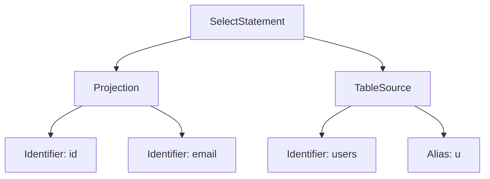

In the [previous essay](/en/blog/inside_a_query_engine_lexical_analysis/), we explored how a lexer transforms a raw string into a stream of tokens. But a stream of tokens is still just a list of words. To understand the **intent** of a query, we need a way to define the rules of how those words can be combined. This is where **Grammar** comes in.

### Introduction to Grammar

A grammar is a formal set of rules that defines the structure of a language. :h[If the lexer provides the vocabulary, the grammar provides the syntax.]

A grammar serves three main purposes:
1.  **Definition**: It explicitly states what is a "valid" query and what is not.
2.  **Guide**: It acts as a blueprint for the Parser (which we will build in the [next part](/en/blog/inside_a_query_engine_handwritten_parser/)).
3.  **Communication**: It allows developers to discuss the language design without ambiguity.

Without a formal grammar, a language is just a collection of "if-else" statements in your code, making it nearly impossible to maintain as complexity grows.

### EBNF: The Language of Grammars

To describe our grammar, we use **Extended Backus–Naur Form (EBNF)**. It is a notation technique for context-free grammars.

In EBNF, we define "rules" (or **productions**). Each rule is called a production because it describes how a non-terminal symbol can be expanded into a sequence of terminals and/or non-terminals. Each rule has a name and a definition of what it consists of. For example, a simplified `SELECT` query in Relop might look like this:

```ebnf
select_statement = "SELECT" projection "FROM" table_source ;
projection       = "*" | identifier ;
table_source     = identifier ;
identifier       = [a-zA-Z_][a-zA-Z0-9_]* ;
```

The latest grammar is available [here](https://github.com/SarthakMakhija/relop/blob/main/docs/grammar.ebnf).

From this definition, we can see that a `select_statement` *must* start with the literal "SELECT", followed by something that satisfies the `projection` rule, then "FROM", and finally something that satisfies `table_source`.

### Recursive Grammar

Real-world languages aren't just flat lists of rules; they are often **recursive**. A rule is recursive if its definition eventually refers back to itself.

Consider a `JOIN` in SQL. A table source could be a simple table name, or it could be a join between table sources.

```ebnf
table_source = identifier | join_clause ;
join_clause  = table_source "JOIN" table_source "ON" expression ;
```

In this example, `table_source` can be a `join_clause`, and a `join_clause` contains more `table_source`s. This recursion allows us to model infinitely deep structures, like joining multiple tables together.

> While recursion is powerful, it introduces two major challenges: **Ambiguity** and **Left Recursion**. We will discuss these in detail later in the [Challenge](#the-challenge-ambiguity-and-left-recursion) section.

### Recursive Descent Parsing

Before we map this grammar to code, let's look at the pattern we'll use: **Recursive Descent**. 

A recursive descent parser is a top-down parser. It begins at the root rule of the grammar and expands into sub-rules using a set of  functions. In our implementation, each grammar rule maps directly to a parsing function, and decisions are made deterministically based on the next token, without backtracking. The result is a parser whose control flow closely mirrors the structure of the EBNF.

### Mapping Grammar to Code

When translating EBNF to a recursive descent parser, we follow predictable patterns. Consider a fuller definition of a `SELECT` statement:

```ebnf
select = "SELECT" projection "FROM" table_source [where] [order] [limit] [";"] ;
```

In our Rust implementation, this grammar rule translates almost line-for-line into a method:

-   Literal strings like `"SELECT"` translate to **expectations** (e.g., `self.expect_keyword("select")?`).
-   Named rules like `projection` translate to **calls** to other parsing methods (e.g., `self.expect_projection()?`).
-   Optional components in brackets `[ ]` translate to **conditional** checks (e.g., `self.maybe_where_clause()?`).

Here is how the parser implementation looks for the above grammar:

```rust
fn parse_select(&mut self) -> Result<Ast, ParseError> {
    self.expect_keyword("select")?;
    let projection = self.expect_projection()?;
    self.expect_keyword("from")?;
    let source = self.expect_table_source()?;
    
    let where_clause = self.maybe_where_clause()?;
    let order_by = self.maybe_order_by()?;
    let limit = self.maybe_limit()?;
    // ...
}
```

And a specific method like `expect_projection` might look like this, handling the choice between a `*` and specific columns:

```rust
fn expect_projection(&mut self) -> Result<Projection, ParseError> {
    if self.eat_if(|token| token.is_star()) {
        return Ok(Projection::All);
    }
    let columns = self.expect_columns()?;
    Ok(Projection::Columns(columns))
}
```

### The Challenge: Ambiguity and Left Recursion

Now that we see how grammar rules map to functions, we can understand two major technical challenges in language design with respect to recursive descent parsing.

#### 1. Left Recursion (The Infinite Loop)

Consider this "obvious" rule for an expression:
```ebnf
expression = expression "+" term | term ;
```

If we map this directly to code, the function `parse_expression()` would immediately call `parse_expression()` as its first action. It would never reach a point where it consumes a token, leading to an immediate **stack overflow**. To fix this, we typically refactor the grammar to remove left recursion, often by converting it into an iterative form inside the parser.

#### 2. Ambiguity and Associativity

A grammar is **ambiguous** if a single query can be produced using two or more different paths (or parse trees). 

Our previous `JOIN` example (`join_clause = table_source "JOIN" table_source`) faced this exact challenge. The query `A JOIN B JOIN C` could be interpreted in two ways:
1.  `(A JOIN B) JOIN C` (The first `table_source` produces `A JOIN B`).
2.  `A JOIN (B JOIN C)` (The second `table_source` produces `B JOIN C`).

Both parses are valid according to that grammar, and they produce different parse trees. We must refactor the grammar to remove ambiguity. Our refactored grammar for `table_source` is:

```ebnf
table_source = identifier [ "JOIN" table_source "ON" expression ] ;
```

Here, the parser consumes an `identifier` first, then optionally recurses into another `JOIN`. Note that this structure makes joins right-associative at the grammar level; left-associativity (if needed) must instead be enforced during AST construction or by using iterative parsing patterns.

```diff
table_source (A JOIN B JOIN C)
+ └── identifier (A)
+      └── JOIN
+           └── table_source (B JOIN C)
+                ├── identifier (B)
+                └── JOIN
+                     └── table_source (C)
```

> In Relop, joins are left-associative. After parsing the base table, the parser processes each subsequent JOIN in a loop and incrementally builds the AST by attaching the new table to the right of the existing structure. Each iteration wraps the previously constructed subtree as the left operand of a new Join node. As a result, a query like `A JOIN B JOIN C` is interpreted as `(A JOIN B) JOIN C`, matching the left-associative behavior expected in SQL engines. The code is available [here](https://github.com/SarthakMakhija/relop/blob/main/src/query/parser/mod.rs#L150).

### Abstract Syntax Tree (AST)

Once the parser validates that the tokens follow the grammar, it doesn't just return "True." It builds a data structure called an **Abstract Syntax Tree (AST)**. It's a tree representation of the query that captures the hierarchical structure of the language.

*   **Tree**: Because languages are hierarchical (a query contains clauses, which contain expressions).
*   **Abstract**: Because it omits concrete syntax details (like semicolons) and preserves only structural meaning

For our `SELECT * FROM employees` query, the AST might look like this in Rust:

```rust
enum Ast {
    Select {
        projection: Projection,
        source: TableSource,
    }
}

enum Projection {
    Star,
    Identifier(String),
}

enum TableSource {
    Table(String),
}
```

The AST is the "final product" of the parsing phase. It is a clean, structured representation of the user's intent that the rest of the database engine can easily understand. The AST for Relop is available [here](https://github.com/SarthakMakhija/relop/blob/main/src/query/parser/ast.rs#L8).

> In Rust, ASTs are beautifully modeled using **Enums**. Since a query node can have multiple variants (e.g., a `Projection` can be a `Star` or specific `Columns`), Rust's algebraic data types allow us to represent this hierarchy with full type safety.

### From Grammar to Tree

Consider the following grammar:

```ebnf
select
= "SELECT" projection "FROM" table_source [";"] ;

table_source
= identifier ["AS" identifier] [join_clause]* ;

projection
= "*"
| identifier ("," identifier)*
```

and a sample query: 

```sql
SELECT id, email FROM users AS u;
```

The parser will provide the following AST.



### Conclusion

Grammar is the "bridge" between the raw tokens of the lexer and the structured trees of the AST. By defining our language rules in EBNF, we create a clear path for implementing a robust and maintainable parser.

In the next part, we will get our hands dirty and implement these rules using the [Recursive Descent](/en/blog/inside_a_query_engine_handwritten_parser) parser.
