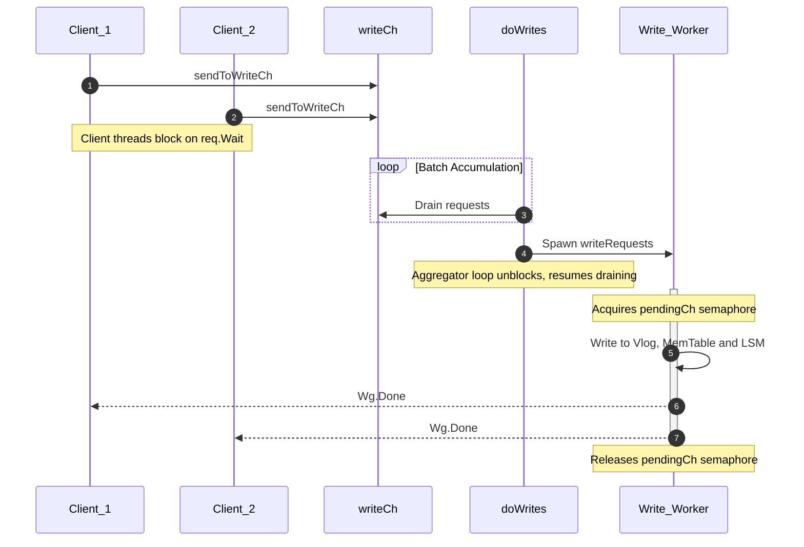
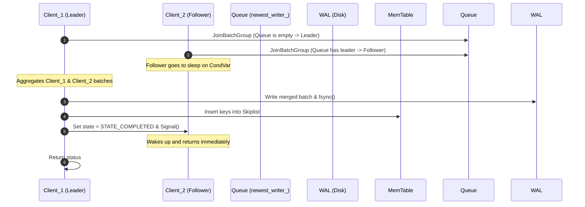
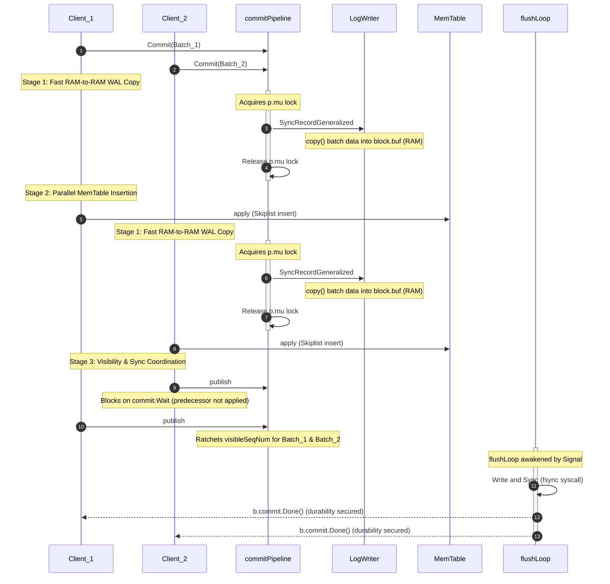

[Log-Structured Merge-tree (LSM)](https://tech-lessons.in/en/blog/wisckey_ssd_conscious_key_value_store/#lsm-tree) storage engines power some of the world's most demanding write-heavy databases, including RocksDB, Cassandra, Pebble, and BadgerDB. Unlike traditional B+Tree-based systems that perform random, in-place updates on disk, LSM storage engines optimize for sequential writes by buffering incoming data in volatile memory before flushing it to persistent storage as immutable sorted files.

However, behind the high write throughput of LSM engines lies a complex web of engineering challenges. Serializing writes to the disk, maintaining read visibility order, managing in-memory components (like MemTables), and reclaiming disk space through compactions all require highly optimized architectural choices.

To understand these engines from first principles, we can catalog their architectures into a series of design patterns across **various categories**:

### Ingest & Commit Concurrency Pipelines

When building storage engines, the write path (ingestion) represents a major concurrency bottleneck. Every write request must durably update index structures (like MemTables) in memory and append to the Write-Ahead Log (WAL) on disk. 

However, at the bottom of the stack lies a harsh hardware constraint: the physical disk boundary is a strict, single-lane bottleneck. Because sequential disk blocks cannot handle concurrent, interleaving byte streams without data corruption, absolute write serialization at the physical file descriptor is mathematically unavoidable. The core challenge of storage engine architecture is deciding **where and how concurrent client threads should wait** for this serialized disk boundary.

To maximize concurrency, storage engines employ ingest pipeline designs that optimize the hand-off between CPU memory operations and disk I/O operations, routing write traffic through one of three primary patterns:

<div class="grid grid-cols-1 md:grid-cols-3 gap-6 my-8">
  <div class="p-6 bg-zinc-50 border border-zinc-200/80 rounded-2xl flex flex-col justify-between hover:shadow-md transition-all duration-300 [&_h4]:mt-0 [&_h4]:mb-2">
    <div>

#### Pipelined Batch Aggregator

<p style="margin-top: 0.25em; margin-bottom: 1em;" class="text-sm text-zinc-600 leading-relaxed">Decouples batch accumulation from write execution using a background worker loop and a separate write worker.</p>
    </div>
    <a href="#pattern-1-pipelined-batch-aggregator-badgerdb" class="inline-flex items-center text-sm font-bold text-zinc-950 hover:text-zinc-700 transition-colors">
      Read more
      <svg class="ml-1 w-4 h-4" fill="none" stroke="currentColor" stroke-width="2" viewBox="0 0 24 24"><path stroke-linecap="round" stroke-linejoin="round" d="M9 5l7 7-7 7"></path></svg>
    </a>
  </div>

  <div class="p-6 bg-zinc-50 border border-zinc-200/80 rounded-2xl flex flex-col justify-between hover:shadow-md transition-all duration-300 [&_h4]:mt-0 [&_h4]:mb-2">
    <div>

#### Group Commit

<p style="margin-top: 0.25em; margin-bottom: 1em;" class="text-sm text-zinc-600 leading-relaxed">Coordinates concurrent threads to pool their write requests together under an elected leader thread.</p>
    </div>
    <a href="#pattern-2-group-commit-rocksdb" class="inline-flex items-center text-sm font-bold text-zinc-950 hover:text-zinc-700 transition-colors">
      Read more
      <svg class="ml-1 w-4 h-4" fill="none" stroke="currentColor" stroke-width="2" viewBox="0 0 24 24"><path stroke-linecap="round" stroke-linejoin="round" d="M9 5l7 7-7 7"></path></svg>
    </a>
  </div>

  <div class="p-6 bg-zinc-50 border border-zinc-200/80 rounded-2xl flex flex-col justify-between hover:shadow-md transition-all duration-300 [&_h4]:mt-0 [&_h4]:mb-2">
    <div>

#### Staged Pipeline Commit

<p style="margin-top: 0.25em; margin-bottom: 1em;" class="text-sm text-zinc-600 leading-relaxed">Treats the commit path as a multi-stage assembly line, minimizing lock hold times to fast RAM-to-RAM copies before inserting into the MemTable concurrently.</p>
    </div>
    <a href="#pattern-3-staged-pipeline-commit-pebble" class="inline-flex items-center text-sm font-bold text-zinc-950 hover:text-zinc-700 transition-colors">
      Read more
      <svg class="ml-1 w-4 h-4" fill="none" stroke="currentColor" stroke-width="2" viewBox="0 0 24 24"><path stroke-linecap="round" stroke-linejoin="round" d="M9 5l7 7-7 7"></path></svg>
    </a>
  </div>
</div>

---

### Pattern 1: Pipelined Batch Aggregator (BadgerDB)

#### The Problem

In a naive architecture, the engine guards the write path using a direct mutual exclusion primitive (such as a standard `sync.Mutex`). Under heavy write pressure, this approach introduces two crippling architectural flaws:

1. **Kernel-Level Thread Thrashing**: It forces concurrent client threads to block directly on OS-level primitives. When writes are highly contested, the CPU wastes massive cycles on context-switching and thread scheduling overhead as threads are constantly put to sleep and woken up.
2. **Blocking the Ingestion Gate**: If the thread responsible for collecting incoming transactions also executes the heavy physical disk I/O sequentially, the engine completely loses its elasticity. While a batch is waiting for a slow disk fsync to complete, the ingestion gate is locked. The engine cannot accept new writes, leverage multi-core parallelism, or utilize fast memory buffers to mask the slow realities of the physical storage layer.

To scale under high concurrency, the engine must separate batch accumulation from the execution of physical disk I/O.

#### The Solution

**Pipelined Batch Aggregator**: It means **client threads do not perform any database writes themselves**. Instead:
1. Client threads package their write requests and send them into a thread-safe, in-memory queue.
2. A dedicated background **accumulator loop** drains this queue and groups incoming requests into a single batch.
3. Once a batch is ready, the accumulator loop hands it off to a **separate, serialized write worker** that writes it to the Value Log (vlog), WAL, and MemTable.
4. Because the write execution is handed off, the accumulator loop is immediately unblocked to resume draining the queue and building the next batch in parallel, protecting the client threads from write latency.

#### Badger's Code

Badger implements this pattern using Go's channel mechanics. When a transaction is committed, its entries are sent to the database's write channel via the `sendToWriteCh` function.

```go
func (db *DB) sendToWriteCh(entries []*Entry) (*request, error) {
	//Code removed for brevity.
	req := requestPool.Get().(*request)
	req.reset()
	req.Entries = entries
	req.Wg.Add(1)
	db.writeCh <- req // [!code highlight]
	y.NumPutsAdd(db.opt.MetricsEnabled, int64(len(entries)))

	return req, nil
}
```

The background goroutine running `doWrites` serves as the **singular batch aggregator** where **incoming requests are batched** in memory. It coordinates batch accumulation and handles the hand-off to the write processor.

```go
func (db *DB) doWrites(lc *z.Closer) {
	defer lc.Done()
	pendingCh := make(chan struct{}, 1)

	writeRequests := func(reqs []*request) {
		if err := db.writeRequests(reqs); err != nil {
			db.opt.Errorf("writeRequests: %v", err)
		}
		<-pendingCh
	}

	reqs := make([]*request, 0, 10)
	for {
		var r *request
		select {
			case r = <-db.writeCh:

			for {
				reqs = append(reqs, r)		 	//batching
				reqLen.Set(int64(len(reqs)))

				if len(reqs) >= 3*kvWriteChCapacity {
					pendingCh <- struct{}{} 	      //write serialization
					goto writeCase
				}
				// Note: Continuous non-blocking polling of db.writeCh 
				// and pendingCh slot availability removed for brevity.
			}

			writeCase:
				go writeRequests(reqs)
				reqs = make([]*request, 0, 10)
				reqLen.Set(0)
		}
	}
}
```

#### The Write Serialization Mechanism (`pendingCh`)

To prevent multiple concurrent write workers from writing to the disk out of order, Badger uses a synchronization channel named `pendingCh` with a capacity of **1**:

* **Acquiring the Write Lock**: Before launching a background writer goroutine (`go writeRequests(reqs)`), the aggregator sends a token into the channel: `pendingCh <- struct{}{}`. If a previous write worker is still running, this send will block, parking the aggregator loop and preventing a second write worker from spawning.
* **Eager Flushes**: If the number of accumulated requests becomes too large (`len(reqs) >= 3 * kvWriteChCapacity`), Badger doesn't wait for the standard loop; it immediately blocks until it can acquire the write lock (`pendingCh <- struct{}{}`) and jumps to trigger the flush (`goto writeCase`).
* **Releasing the Lock**: Once the active write worker completes `db.writeRequests(reqs)`, it drains a token from the channel: `<-pendingCh`. This immediately unblocks the aggregator loop, allowing it to spawn the next write worker.

`doWrites` is available [here](https://github.com/dgraph-io/badger/blob/main/db.go#L943).

#### Visualizing the Pipeline



#### The Invariant Control

To prevent data corruption from concurrent file descriptor writes, the execution slot is guarded by the **concurrency gate** `pendingCh := make(chan struct{}, 1)`.

This design creates two core invariant controls:

1. **Strict Write Serialization**: Badger ensures only one background worker writes to disk at a time by sending a token into `pendingCh` (which has a capacity of 1) before spawning the worker. Once the worker finishes the write, it removes the token from the channel, allowing the next worker to start.
2. **Self-Regulating Backpressure**: If the underlying disk I/O becomes saturated and writes slow down, the `pendingCh` semaphore remains filled. As a result, the `doWrites` loop blocks at `pendingCh <- struct{}{}` when trying to flush. This blockage halts the consumption of `db.writeCh`, causing it to fill up. Once `db.writeCh` is saturated, client threads calling `sendToWriteCh` will naturally block on the channel send (`db.writeCh <- req`), dynamically matching the client ingestion rate to the physical limits of the storage hardware without crashing the runtime.
---

### Moving from Aggregator Loops to Cooperative Threads

Badger’s Pipelined Batch Aggregator is highly effective because it shields client threads from write latency by offloading all batch accumulation and write execution to dedicated background loops. However, this model introduces some architectural trade-offs:
* **Background Scheduling Overhead**: Offloading to separate goroutines and passing batches through channels adds runtime queueing latency and thread-context overhead.
* **Lack of Direct Thread Concurrency**: Client threads remain entirely passive, waiting on synchronization primitives while background workers carry out all tasks sequentially.

What if client threads coordinated directly on the write path, electing a temporary leader to execute writes on behalf of the group, rather than relying on a permanent background aggregator loop?

To solve this, storage engines like **RocksDB** utilize a different coordination pattern: **Group Commit**.

---

### Pattern 2: Group Commit (RocksDB)

#### The Problem

If each client thread independently attempts to lock the WAL, write its data, and call `fsync()` to ensure durability:
1. **Context Switching Storms**: CPU cores will spend more time switching between threads (blocking and waking them up) than performing actual database operations.
2. **I/O Bottleneck**: The storage device is flooded with tiny, random writes, which severely limits throughput.

To prevent this, the storage engine must find a way to merge multiple concurrent write requests into a single sequential write operation on the disk, making the process cooperative.

#### The Solution

**Group Commit**: It means **concurrent client threads cooperate to pool their writes under a single dynamically elected leader**.
1. **Joining the Queue**: When a client thread wants to write, it packages its write request and registers it in a lock-free write queue.
2. **Leader Election**: The first thread to enter the queue (or find it leaderless) is elected as the **Leader**. Subsequent threads joining the queue become **Followers** and go to sleep.
3. **Batch Aggregation**: The Leader thread takes the lock, drains all pending requests from the queue, and merges them into a single write batch.
4. **Serialized Disk Write**: The Leader writes this consolidated batch sequentially to the WAL and performs a single `fsync()`.
5. **Parallel MemTable Update (Optional)**: After the WAL is secured, the Leader can write the data to the MemTable, or delegate the memory updates back to the Followers to run in parallel.
6. **Waking Followers**: Once the write is complete, the Leader wakes up the Followers and releases the queue. The Followers return immediately without ever acquiring the write lock or performing disk I/O.

#### RocksDB's Code

RocksDB implements this pattern in its write path inside [db_impl_write.cc](https://github.com/facebook/rocksdb/blob/main/db/db_impl/db_impl_write.cc).

When a thread calls `Write()`, it joins the write queue using `JoinBatchGroup`:

```cpp
Status DBImpl::Write(const WriteOptions& write_opts, WriteBatch* my_batch) {
  // Join the queue and wait for our turn
  Writer w(my_batch, callback, log_ref, disable_wal);
  write_thread_.JoinBatchGroup(&w); // [!code highlight]

  if (w.state == WriteThread::STATE_COMPLETED) {
    return w.status; // Follower: write was completed by the leader
  }
  
  // Leader: execute the writes for the group
  WriteGroup write_group;
  write_thread_.EnterAsBatchGroupLeader(&w, &write_group);
  
  Status status = WriteToWAL(write_group); // [!code highlight]
  // Write to MemTable...
  
  write_thread_.ExitAsBatchGroupLeader(write_group, status);
  return status;
}
```

---

#### 1. How Writers Join and Wait (`JoinBatchGroup`)

When a thread calls `JoinBatchGroup`, it pushes its `Writer` node onto a lock-free linked list queue using an atomic exchange (`std::atomic<Writer*> newest_writer_`):

```cpp
void WriteThread::JoinBatchGroup(Writer* w) {
  // Push onto the state queue
  LinkOne(w, &newest_writer_); // [!code highlight]
  
  // If we are not the leader, wait for completion or state change
  while (w->state == STATE_GROUP_LEADER || w->state == STATE_LOCKED_WAITING) {
    w->StateMutex().Lock();
    w->StateCond().Wait();
    w->StateMutex().Unlock();
  }
}
```

* **If the queue was empty**: The thread immediately transitions to `STATE_GROUP_LEADER` and proceeds to execute the write.
* **If a leader is already writing**: The thread transitions to `STATE_LOCKED_WAITING`. It blocks on its own thread-local condition variable (`StateCond().Wait()`) and goes to sleep.

---

#### 2. How the WAL Write and Sync are Coordinated

The WAL write is executed **entirely by the leader thread**. Follower threads do not touch the disk.

The coordination happens inside `WriteToWAL`:
1. **Aggregating Batches**: The leader iterates through the `write_group.writers` list.
2. **Writing to WAL**: For each writer `w` in the group, the leader extracts the raw `WriteBatch` bytes and appends them to the active WAL log writer:
   ```cpp
   for (Writer* w : write_group.writers) {
     if (w->Callback() != nullptr) {
       w->Callback()->OnWriteForInitialization();
     }
     log_writer->AddRecord(w->batch->GetData()); // [!code highlight]
   }
   ```
3. **Single Physical Sync**: If any writer in the active group requested synchronous durability (`sync = true`), the leader issues a single `fsync()` or `fdatasync()` on the WAL file descriptor:
   ```cpp
   if (group_needs_sync) {
     log_writer->file()->Sync(use_fsync); // [!code highlight]
   }
   ```

Because of this coordination, if 50 threads request a write simultaneously, the disk only performs **one** sequential append and **one** physical sync, significantly reducing disk latency and increasing IOPS throughput.

---

#### 3. What Happens When New Threads Arrive While the Leader is Writing?

Since the queue insertion (`LinkOne`) is lock-free and atomic, new threads can continuously append their `Writer` nodes to `newest_writer_` even while the leader thread is actively performing disk write operations:

```
[Active Leader] (Writing to WAL)
   │
   └──► [Queue]: Writer_A (Follower, Asleep) ──► Writer_B (Follower, Asleep) ──► [newest_writer_] (New arrivals)
```

These new writers see that the pipeline has an active leader, so they immediately park on their respective condition variables and sleep.

---

#### 4. Leadership Hand-off (`ExitAsBatchGroupLeader`)

When the active leader finishes writing the WAL and updating the MemTable, it coordinates the teardown and hand-off inside `ExitAsBatchGroupLeader`:

```cpp
void WriteThread::ExitAsBatchGroupLeader(WriteGroup& write_group, Status status) {
  Writer* leader = write_group.leader;
  Writer* last_writer = write_group.last_writer;
  
  // 1. Wake up followers and mark them completed
  for (Writer* w : write_group.writers) {
    if (w != leader) {
      w->status = status;
      w->state = STATE_COMPLETED; // [!code highlight]
      w->StateCond().Signal();    // Wake up follower thread
    }
  }

  // 2. Hand off leadership to the next pending writer in line
  Writer* next_leader = last_writer->link_next; // [!code highlight]
  if (next_leader != nullptr) {
    next_leader->state = STATE_GROUP_LEADER;
    next_leader->StateCond().Signal(); // [!code highlight] -> Promote and wake next leader
  }
}
```

* **Waking Followers**: The leader loops through all the writers it processed, marks their state as `STATE_COMPLETED`, and signals their condition variables. These follower threads wake up, bypass the write logic, and return to their callers.
* **Promoting the Next Leader**: The leader checks `last_writer->link_next` to see if new threads joined the queue while it was writing. If a writer is present, the leader promotes it to `STATE_GROUP_LEADER` and signals its condition variable. The new leader wakes up, aggregates the newly accumulated queue, and starts the next group commit!

#### Visualizing the Pipeline


---

### Moving from Thread Cooperation to Multi-Stage Assembly Lines

RocksDB's Group Commit is extremely efficient at reducing disk I/O overhead by letting a single leader thread write to the WAL and perform the sync syscall on behalf of a whole group of sleeping followers. However, it still exhibits two major bottlenecks under massive concurrency:
* **Idle Thread Blockage**: While the leader is active, all follower threads in the group are completely idle, blocked on conditional variables.
* **Coarse-Grained Locking**: The leader thread executes the entire write sequence sequentially—writing to the WAL, syncing the log, and writing to the MemTable, while holding the global write thread lock. The CPU-heavy MemTable SkipList updates are not parallelized across the active cores.

Could we split the write path into separate stages, allowing client threads to drive their own writes through an assembly line where lock retention is restricted to fast memory copies, and CPU-heavy updates run in parallel?

This is precisely the problem solved by Pebble's **Staged Pipeline Commit**.

---

### Pattern 3: Staged Pipeline Commit (Pebble)

#### The Problem

In a naive architecture, guarding the write path with a global mutex forces client threads to block and remain completely idle for the entire duration of both the CPU-heavy memory index (MemTable) insertion and the slow physical disk sync (fsync).

Conversely, attempting to solve this by forcing threads to pool together and sleep while a single leader thread handles the work (like RocksDB’s Cooperative Group Commit) introduces massive thread-scheduling latencies and context-switching overhead on modern high-concurrency runtimes (like Go’s goroutine scheduler).

#### The Solution

**Staged Pipeline Commit**: It means **client threads themselves drive the write process, but they do it in decoupled stages** like a multi-stage assembly line:

1. **The Brief Lock (RAM WAL copy)**: A client thread briefly locks a mutex only to claim its sequence number and perform a fast memory copy of its batch into Pebble's WAL memory buffer (RAM). Since this is strictly a RAM-to-RAM copy, it completes quickly, and the mutex is immediately dropped.
2. **The Parallel Fan-out (MemTable inserts)**: Having dropped the lock, multiple client threads concurrently write their mutations into the lock-free Skiplist in the MemTable. They utilize separate CPU cores, running in parallel.
3. **The Background Sync (Disk durability)**: A background loop collects the batches and performs the slow physical write to disk and the fsync syscall. The client threads only block to wait for this background sync to finish before returning.

By splitting the write path into these stages, the serialized lock is held only briefly (RAM speed) rather than for the duration of the disk write or CPU-heavy MemTable updates, allowing high multi-core parallelism.

#### The Execution Architecture

Pebble orchestrates this staged assembly line inside the [commitPipeline](https://github.com/cockroachdb/pebble/blob/master/commit.go#L299) component. When an active client goroutine calls `Commit()`, it drives its own payload linearly through three distinct pipeline stages:

#### Code-Level Pipeline Decomposition

The top-level orchestration of the assembly line is driven directly by the client goroutine inside `Commit()`:

```go
func (p *commitPipeline) Commit(b *Batch, syncWAL bool, noSyncWait bool) error {
    p.commitQueueSem <- struct{}{}
    if syncWAL {
        p.logSyncQSem <- struct{}{}
    }

    // Stage 1: Fast RAM-to-RAM WAL copy under a brief mutex lock
    mem, err := p.prepare(b, syncWAL, noSyncWait) // [!code highlight]
    if err != nil {
        b.db = nil
        return err
    }

    // Stage 2: Multi-core MemTable insertion outside the lock
    if err := p.env.apply(b, mem); err != nil { // [!code highlight]
        b.db = nil
        return err
    }

    // Stage 3: Ticket-ordered visibility publishing
    p.publish(b) // [!code highlight]

    <-p.commitQueueSem

    if syncWAL && !noSyncWait {
        // Enforce durability gate after visibility is achieved
        b.commit.Wait()
    }
    return err
}
```

#### Stage 1: The Fast Staging Gate (WAL Memory Copy)

Rather than keeping the pipeline locked while writing to physical hardware, Pebble restricts lock retention to a fast RAM memory copy. Inside the [prepare](https://github.com/cockroachdb/pebble/blob/master/commit.go#L318) method, the pipeline mutex `p.mu` is acquired, and it is dropped the instant the memory allocation completes:

```go
func (p *commitPipeline) prepare(b *Batch, syncWAL bool, noSyncWait bool) (*memTable, error) {
    p.mu.Lock() // [!code highlight]

    p.pending.enqueue(b) // Maintain strict sequence order
    b.setSeqNum(p.env.logSeqNum.Add(base.SeqNum(n)) - base.SeqNum(n)) // Allocate Ticket

    // Write batch bytes into memory buffer
    mem, err := p.env.write(b, syncWG, syncErr) // [!code highlight]

    p.mu.Unlock() // [!code highlight] -> Released before hitting disk or MemTable
    return mem, err
}
```

Deep inside [SyncRecordGeneralized](https://github.com/cockroachdb/pebble/blob/master/record/log_writer.go#L979) and [emitFragmentRecyclable](https://github.com/cockroachdb/pebble/blob/master/record/log_writer.go#L1034), we see that `p.env.write` performs nothing more than a standard memory-to-memory copy into Pebble's internal `block.buf`:

```go
// Inside record/log_writer.go -> emitFragmentRecyclable
r := copy(b.buf[i+recyclableHeaderSize:], p)

// Inside record/log_writer.go -> SyncRecordGeneralized
if ps.syncRequested() {
    f := &w.flusher
    f.pendingSyncs.push(ps) // Register completion WaitGroup tracking (b.commit)
    f.ready.Signal()        // Signal the decoupled background flusher daemon
}
```

Because this step is strictly a RAM-to-RAM operation, the thread releases the mutex quickly, clearing the gate for trailing application threads. Simultaneously, if synchronous durability is requested, `pendingSyncs.push(ps)` registers the client's completion intent (`b.commit`) in the flusher's queue, allowing the decoupled background flusher daemon to eventually notify and wake the thread once the WAL is synced to disk.

#### Stage 2: Parallel In-Memory Fan-out (Concurrent MemTable Insertion)

Having instantly dropped the `p.mu` gate lock, the client thread enters an unlocked execution plane. It runs `p.env.apply(b, mem)` under its own power, fanning out across its own dedicated CPU core to update the MemTable SkipList concurrently alongside all other active threads that have cleared the staging gate.

#### Stage 3: Ticket-Ordered Release (Publish)

Because memory mutations complete at variable speeds depending on batch size, threads may finish their MemTable updates out of order. To maintain read consistency, a thread cannot instantly expose its mutations for reading. It invokes [publish](https://github.com/cockroachdb/pebble/blob/master/commit.go#L476) to manage visibility:

```go
func (p *commitPipeline) publish(b *Batch) {
    b.applied.Store(true)
    for {
        t := p.pending.dequeueApplied()
        if t == nil {
			// Head of the queue is blocked by a lagging predecessor; park until signaled.
            b.commit.Wait() // [!code highlight]
            break
        }
        // Advance global visibleSeqNum up to make t's writes safe for readers
        t.commit.Done()
    }
}
```

This loop ensures that transactions are exposed to readers in strict sequence number order, moving the global read watermark forward without introducing read visibility holes. 

The WaitGroup `b.commit` acts as a **single consolidated synchronization gate** for both memory visibility and WAL sync durability, initialized with a counter of **2** in `prepare()`. To see how this prevents blocking client threads twice, let's trace two concurrent goroutines, **T1** (first in queue) and **T2** (second in queue):

* **T2 Finishes MemTable First (Out of Order)**: T2 enters `publish()`. Since T1 (head of queue) is still writing, T2's pop attempt returns `nil`. T2 parks on `T2.commit.Wait()`.
* **T1 Finishes MemTable Second**: T1 enters `publish()`, dequeues itself, and ratchets visibility (`T1.commit` drops to 1). It then dequeues T2 and ratchets its visibility (`T2.commit` drops to 1). T1 then parks on `T1.commit.Wait()`.
* **Background Sync Finishes**: Concurrently, the background `flushLoop` fsyncs the WAL and calls `Done()` on both WaitGroups. Both counters drop to 0, waking up both threads.

By consolidating visibility and sync wait into `b.commit.Wait()`, threads block at most once, and the final `b.commit.Wait()` at the end of `Commit()` returns immediately.

#### The Durability Track: Asynchronous Group Syncing

Concurrently with the memory insertion stage, an independent, long-lived background goroutine (`flushLoop`) sits entirely out of the application's critical path. When awakened by `f.ready.Signal()`, it drains the accumulated `pendingSyncs` queue, aggregates multiple threads' blocks that hit the buffer in that micro-window, and runs the actual physical fsync block inside [flushPending](https://github.com/cockroachdb/pebble/blob/master/record/log_writer.go#L780):

```go
// Inside record/log_writer.go: flushPending()
_, err = w.w.Write(data)              // Flush buffered blocks to OS file descriptor
if err == nil && w.s != nil {
    syncLatency, err = w.syncWithLatency() // [!code highlight] -> Triggers physical fsync syscall
}
// Notify all aggregated client WaitGroups that disk safety is secured
```

The client thread only pays the cost of physical disk I/O at the final `b.commit.Wait()` step inside `Commit()`, allowing the engine to leverage concurrent multi-core RAM processing while the disk hardware is actively executing physical syncs.

#### Visualizing the Pipeline


#### Summary

Pebble achieves high write throughput by splitting the commit path into three decoupled, staged phases driven directly by client goroutines:
1. **Serialized Memory Write**: A single coordination lock is held briefly to claim ticket order and perform a fast RAM-to-RAM copy of the batch into the WAL buffer.
2. **Concurrent In-Memory Insertion**: The lock is immediately dropped, freeing multiple client goroutines to update the concurrent MemTable in parallel across different CPU cores.
3. **Decoupled Durability & Release**: Goroutines cooperatively advance the global read visibility window in sequence number order and block until the physical writes and fsync calls are completed asynchronously by a background worker loop.

---

### Architectural Comparison & Ramifications

To choose the right concurrency pattern for an LSM storage engine, it is helpful to look at how these three designs handle resource contention, thread scheduling, and disk synchronization side-by-side:

| Dimension | Pipelined Batch Aggregator (BadgerDB) | Group Commit (RocksDB) | Staged Pipeline Commit (Pebble) |
| :--- | :--- | :--- | :--- |
| **Ingestion Drive** | Dedicated background accumulator loop | Cooperative client threads (dynamic leader) | Cooperative client threads (multi-stage pipeline) |
| **Lock Retention** | None on client (clients write to channels) | Coarse write lock held by Leader for entire write path | Brief lock held only for sequence allocation & RAM-to-RAM WAL copy |
| **MemTable Insertion** | Serialized background write worker | Serialized by the Leader thread (by default) | Fully parallel across multi-core CPU by client threads |
| **WAL Sync Strategy** | Serialized background write worker | Batch consolidated fsync by the Leader | Asynchronous background flusher loop (decoupled from inserts) |
| **Thread Blockage** | Client threads block waiting on Go channels | Follower threads sleep on OS conditional variables | Client threads block once at the end of the pipeline for visibility & sync |

---

### Detailed Design Trade-offs & Implications

#### 1. BadgerDB's Pipelined Batch Aggregator: Simple but Bound by the Aggregator Thread

BadgerDB's design prioritizes code clarity by using Go's native concurrency primitives (channels and goroutines). 

* **Clean Backpressure Control**: Bounded channels act as a natural rate-limiter. If the storage device cannot keep up, the channel saturates, blocking client threads at the API level and protecting the system from out-of-memory crashes.
* **The Single-Threaded Bottleneck**: Because a single accumulator loop processes all writes sequentially, it is highly sensitive to CPU work. If MemTable insertion becomes slow, the aggregator loop halts, preventing new batches from being accumulated. In high-throughput, multi-core systems, the single-threaded aggregator can become a scheduling bottleneck.

#### 2. RocksDB's Group Commit: Zero-Loop Overhead but Coarse Locking

RocksDB avoids background accumulator threads entirely, orchestrating a self-organizing pipeline using the client threads themselves.

* **Dynamic Cooperative Execution**: The first thread to arrive is elected Leader and performs all physical disk I/O on behalf of the group, which naturally groups writes without requiring background thread loops.
* **Follower Parking Jitter**: Followers go to sleep on OS condition variables. When the Leader finishes, it signals all followers. Waking dozens of threads simultaneously can trigger OS thread-scheduling delays, introducing tail-latency (p99) jitter.
* **Lack of CPU Parallelism**: While the Leader is writing to the WAL and updating the MemTable, all other threads sit completely idle. The CPU-heavy task of inserting keys into the MemTable is not parallelized, leaving multi-core hardware underutilized.

#### 3. Pebble's Staged Pipeline Commit: Maximum Throughput at the Cost of Complexity

Pebble represents the state-of-the-art in pipeline commit design, splitting the write path into an assembly line where lock holding is minimized to RAM memory speeds.

* **Highly Parallel Memory Writes**: By releasing the coordination lock immediately after the WAL memory copy, Pebble allows hundreds of threads to insert their keys into the lock-free MemTable concurrently, maximizing multi-core performance.
* **Predecessor Head-of-Line Blocking**: To guarantee read consistency, the global read watermark must advance in strict sequence order to prevent "read visibility holes" (where a fast write is visible but a slow predecessor write is not). 
  * *Example*: Suppose **T1** (seq 100), **T2** (seq 101), and **T3** (seq 102) write concurrently. If **T2** and **T3** finish their MemTable updates quickly but **T1** is slow (due to a large batch or CPU preemption), **T2** and **T3** must block on `b.commit.Wait()` and wait for **T1** to complete. Thus, a lagging thread can temporarily stall read watermark progression.
* **System Complexity**: The coordinate pipeline is difficult to debug and trace, relying on complex state variables, semaphores, and strict sequence tracking.

---

### Other Categories Coming Soon

* **In-Memory Component Patterns**
* **Durability & Persistent Storage Patterns**
* **Metadata Journaling Patterns**