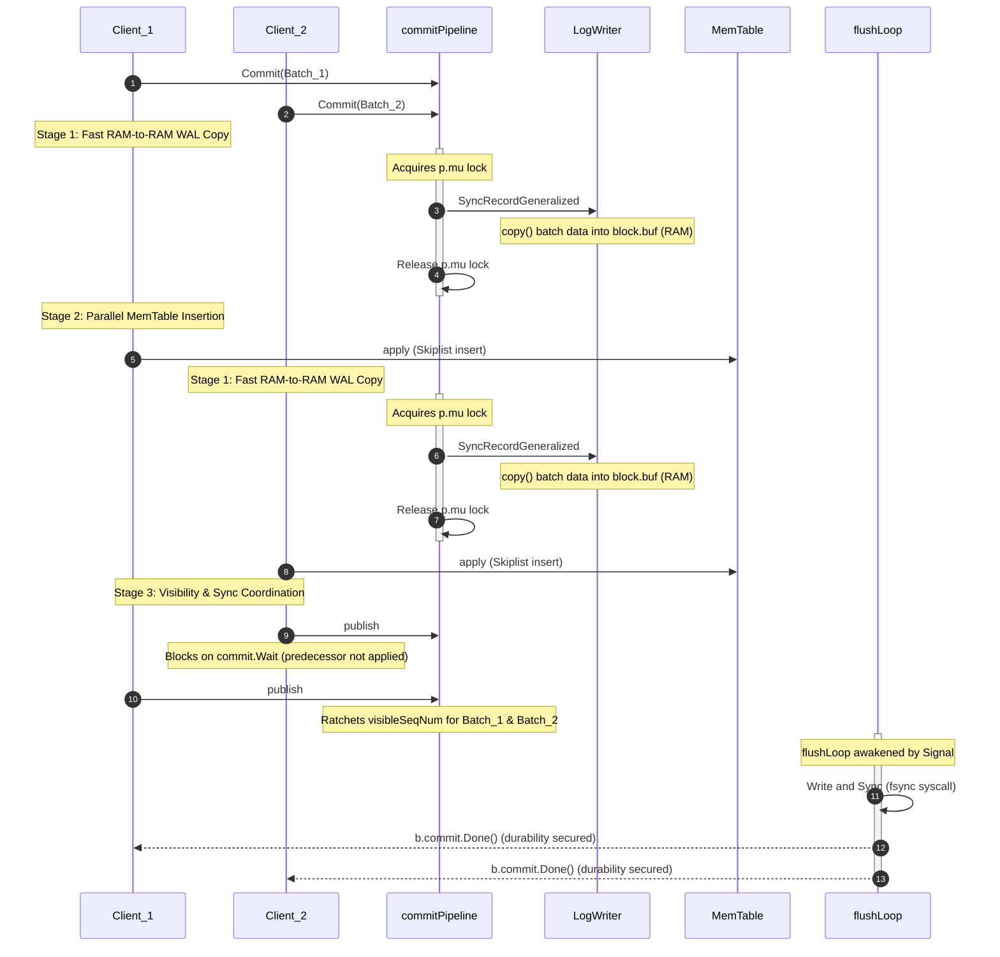

*This article is part of the series **[Patterns of LSM Storage Engines](/en/blog/patterns_of_lsm_storage_engines/)**.*

When building or analyzing high-performance storage engines, one of the most critical engineering challenges is coordinating concurrent client threads across the boundaries of volatile memory (RAM) and non-volatile storage (disk). If every client thread manages its own lock acquisition and performs synchronous disk I/O, the storage engine quickly succumbs to thread contention, excessive context switching, and low throughput.

To solve this, modern engines like Badger, RocksDB, and Pebble employ highly optimized concurrency pipelines on their ingest paths. Rather than utilizing naive locking, they decouple batch accumulation from physical write execution.

In this article, we explore the second major pattern of write path concurrency: **The Staged Pipeline Commit**, as implemented by CockroachDB's [Pebble](https://github.com/cockroachdb/pebble).

---

### Pattern 2: Staged Pipeline Commit (Pebble’s Pattern)

#### The Problem

In a write-heavy storage engine, concurrent client threads continuously issue mutations (e.g., `Put` or `Delete`). However, at the bottom of the stack lies a harsh hardware constraint: the disk boundary is a strict, single-lane bottleneck. Because sequential disk lines cannot handle concurrent interleaving bytes without data corruption, absolute write serialization at the physical file descriptor is mathematically unavoidable.

The core challenge of storage engine architecture is deciding where and how concurrent client threads should wait for this serialized disk boundary.

In a naive architecture, guarding the write path with a global mutex forces client threads to block and remain completely idle for the entire duration of both the CPU-heavy memory index (MemTable) insertion and the slow physical disk sync (fsync).

Conversely, attempting to solve this by forcing threads to pool together and sleep while a single leader thread handles the work (like RocksDB’s Cooperative Group Commit) introduces massive thread-scheduling latencies and context-switching overhead on modern high-concurrency runtimes (like Go’s goroutine scheduler).

#### The Solution

**Staged Pipeline Commit**: It means **client threads themselves drive the write process, but they do it in decoupled stages** like a multi-stage assembly line:

1. **The Brief Lock (RAM WAL copy)**: A client thread briefly locks a mutex only to claim its sequence number and perform a fast memory copy of its batch into Pebble's WAL memory buffer (RAM). Since this is strictly a RAM-to-RAM copy, it takes microseconds, and the mutex is immediately dropped.
2. **The Parallel Fan-out (MemTable inserts)**: Having dropped the lock, multiple client threads concurrently write their mutations into the lock-free Skiplist in the MemTable. They utilize separate CPU cores, running in parallel.
3. **The Background Sync (Disk durability)**: A background loop collects the batches and performs the slow physical write to disk and the fsync syscall. The client threads only block to wait for this background sync to finish before returning.

By splitting the write path into these stages, the serialized lock is held only for microseconds (RAM speed) rather than milliseconds (disk speed or CPU-heavy MemTable updates), allowing high multi-core parallelism.

#### The Execution Architecture

Pebble orchestrates this staged assembly line inside the [commitPipeline](https://github.com/cockroachdb/pebble/blob/master/commit.go#L299) component. When an active client goroutine calls `Commit()`, it drives its own payload linearly through three distinct pipeline stages:

#### Code-Level Pipeline Decomposition

The top-level orchestration of the assembly line is driven directly by the client goroutine inside `Commit()`:

```go
func (p *commitPipeline) Commit(b *Batch, syncWAL bool, noSyncWait bool) error {
    p.commitQueueSem <- struct{}{}
    if syncWAL {
        p.logSyncQSem <- struct{}{}
    }

    // Stage 1: Fast RAM-to-RAM WAL copy under a brief mutex lock
    mem, err := p.prepare(b, syncWAL, noSyncWait) // [!code highlight]
    if err != nil {
        b.db = nil
        return err
    }

    // Stage 2: Multi-core MemTable insertion outside the lock
    if err := p.env.apply(b, mem); err != nil { // [!code highlight]
        b.db = nil
        return err
    }

    // Stage 3: Ticket-ordered visibility publishing
    p.publish(b) // [!code highlight]

    <-p.commitQueueSem

    if syncWAL && !noSyncWait {
        // Enforce durability gate after visibility is achieved
        b.commit.Wait()
    }
    return err
}
```

#### Stage 1: The Fast Staging Gate (WAL Memory Copy)

Rather than keeping the pipeline locked while writing to physical hardware (which takes milliseconds), Pebble restricts lock retention to a fast, microsecond-scale RAM memory copy. Inside the [prepare](https://github.com/cockroachdb/pebble/blob/master/commit.go#L318) method, the pipeline mutex `p.mu` is acquired, and it is dropped the instant the memory allocation completes:

```go
func (p *commitPipeline) prepare(b *Batch, syncWAL bool, noSyncWait bool) (*memTable, error) {
    p.mu.Lock() // [!code highlight]

    p.pending.enqueue(b) // Maintain strict sequence order
    b.setSeqNum(p.env.logSeqNum.Add(base.SeqNum(n)) - base.SeqNum(n)) // Allocate Ticket

    // Write batch bytes into memory buffer
    mem, err := p.env.write(b, syncWG, syncErr) // [!code highlight]

    p.mu.Unlock() // [!code highlight] -> Released before hitting disk or MemTable
    return mem, err
}
```

Deep inside [SyncRecordGeneralized](https://github.com/cockroachdb/pebble/blob/master/record/log_writer.go#L979) and [emitFragmentRecyclable](https://github.com/cockroachdb/pebble/blob/master/record/log_writer.go#L1034), we see that `p.env.write` performs nothing more than a standard memory-to-memory copy into Pebble's internal `block.buf`:

```go
// Inside record/log_writer.go -> emitFragmentRecyclable
r := copy(b.buf[i+recyclableHeaderSize:], p)

// Inside record/log_writer.go -> SyncRecordGeneralized
if ps.syncRequested() {
    f := &w.flusher
    f.pendingSyncs.push(ps) // Register completion WaitGroup tracking (b.commit)
    f.ready.Signal()        // Signal the decoupled background flusher daemon
}
```

Because this step is strictly a RAM-to-RAM operation, the thread releases the mutex in microseconds, clearing the gate for trailing application threads. Simultaneously, if synchronous durability is requested, `pendingSyncs.push(ps)` registers the client's completion intent (`b.commit`) in the flusher's queue, allowing the decoupled background flusher daemon to eventually notify and wake the thread once the WAL is synced to disk.

#### Stage 2: Parallel In-Memory Fan-out (Concurrent MemTable Insertion)

Having instantly dropped the `p.mu` gate lock, the client thread enters an unlocked execution plane. It runs `p.env.apply(b, mem)` under its own power, fanning out across its own dedicated CPU core to update the MemTable SkipList concurrently alongside all other active threads that have cleared the staging gate.

#### Stage 3: Ticket-Ordered Release (Publish)

Because memory mutations complete at variable speeds depending on batch size, threads may finish their MemTable updates out of order. To maintain read consistency, a thread cannot instantly expose its mutations for reading. It invokes [publish](https://github.com/cockroachdb/pebble/blob/master/commit.go#L476) to manage visibility:

```go
func (p *commitPipeline) publish(b *Batch) {
    b.applied.Store(true)
    for {
        t := p.pending.dequeueApplied()
        if t == nil {
			// Head of the queue is blocked by a lagging predecessor; park until signaled.
            b.commit.Wait() // [!code highlight]
            break
        }
        // Advance global visibleSeqNum up to make t's writes safe for readers
        t.commit.Done()
    }
}
```

This loop ensures that transactions are exposed to readers in strict sequence number order, moving the global read watermark forward without introducing read visibility holes. 

The WaitGroup `b.commit` acts as a **single consolidated synchronization gate** for both memory visibility and WAL sync durability, initialized with a counter of **2** in `prepare()`. To see how this prevents blocking client threads twice, let's trace two concurrent goroutines, **T1** (first in queue) and **T2** (second in queue):

* **T2 Finishes MemTable First (Out of Order)**: T2 enters `publish()`. Since T1 (head of queue) is still writing, T2's pop attempt returns `nil`. T2 parks on `T2.commit.Wait()`.
* **T1 Finishes MemTable Second**: T1 enters `publish()`, dequeues itself, and ratchets visibility (`T1.commit` drops to 1). It then dequeues T2 and ratchets its visibility (`T2.commit` drops to 1). T1 then parks on `T1.commit.Wait()`.
* **Background Sync Finishes**: Concurrently, the background `flushLoop` fsyncs the WAL and calls `Done()` on both WaitGroups. Both counters drop to 0, waking up both threads.

By consolidating visibility and sync wait into `b.commit.Wait()`, threads block at most once, and the final `b.commit.Wait()` at the end of `Commit()` returns immediately.

#### The Durability Track: Asynchronous Group Syncing

Concurrently with the memory insertion stage, an independent, long-lived background goroutine (`flushLoop`) sits entirely out of the application's critical path. When awakened by `f.ready.Signal()`, it drains the accumulated `pendingSyncs` queue, aggregates multiple threads' blocks that hit the buffer in that micro-window, and runs the actual physical fsync block inside [flushPending](https://github.com/cockroachdb/pebble/blob/master/record/log_writer.go#L780):

```go
// Inside record/log_writer.go: flushPending()
_, err = w.w.Write(data)              // Flush buffered blocks to OS file descriptor
if err == nil && w.s != nil {
    syncLatency, err = w.syncWithLatency() // [!code highlight] -> Triggers physical fsync syscall
}
// Notify all aggregated client WaitGroups that disk safety is secured
```

The client thread only pays the cost of physical disk I/O at the final `b.commit.Wait()` step inside `Commit()`, allowing the engine to leverage concurrent multi-core RAM processing while the disk hardware is actively executing physical syncs.

#### Visualizing the Pipeline



#### Summary

Pebble achieves high write throughput by splitting the commit path into three decoupled, staged phases driven directly by client goroutines:
1. **Serialized Memory Write**: A single coordination lock is held briefly to claim ticket order and perform a microsecond-fast RAM-to-RAM copy of the batch into the WAL buffer.
2. **Concurrent In-Memory Insertion**: The lock is immediately dropped, freeing multiple client goroutines to update the concurrent MemTable in parallel across different CPU cores.
3. **Decoupled Durability & Release**: Goroutines cooperatively advance the global read visibility window in sequence number order and block until the physical writes and fsync calls are completed asynchronously by a background worker loop.
