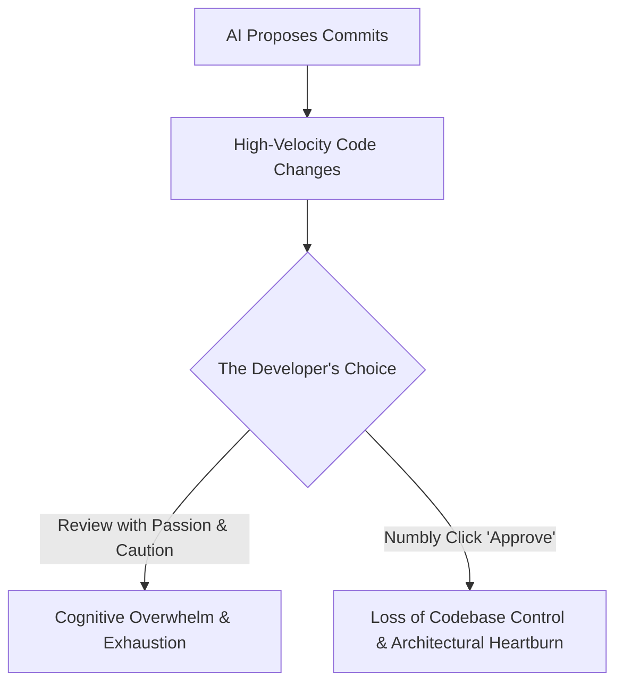

This essay is about a feeling that has been bothering me lately: a growing frustration in my relationship with AI coding assistants. It explores what happened to my design, my sense of ownership, and the joy of programming when I delegated the implementation to an AI. 

To see this clearly, I'll walk through my journey: starting with a UniBasic-to-Java transpiler where I welcomed the AI into the driver's seat, and how that experience forced me to establish a "slow code" sandbox to reclaim the craft.

---

### The Genesis: Handcrafting a Transpiler

The story begins with a new project: building a transpiler from **[UniBasic](https://www.unibasic.com/)** to structured, modern **Java**. A transpiler is simply a source-to-source compiler. In this case, it takes the code written in UniBasic and translates it directly into equivalent Java source code. 

Since this was a complex project, I designed and built the core engine entirely by hand, phase by phase:

```
[UniBasic Source] ──> [Lexer] ──> [Parser] ──> [AST] ──> [Semantic Analysis] ──> [Transformer] ──> [Emitter] ──> [Java Code]
```

1. **The Lexer:** Tokenizing the legacy UniBasic source files, converting raw characters into a clean stream of syntactical tokens while handling legacy peculiarities.
2. **The Parser:** Implementing a hand-written hybrid parser, combining **recursive descent** for statements and declarations with a **Pratt parser** (operator precedence) to elegantly handle operator precedence and associativity in complex expressions.
3. **The AST (Abstract Syntax Tree):** Designing the strongly-typed in-memory representation of the source code structure, capturing variable declarations, subroutines, loops, and expressions.
4. **Semantic Analysis:** Resolving symbols, identifying input and output parameters of a subroutine (method in UniBasic), performing type binding etc.
5. **The Transformer:** Translating legacy UniBasic keywords and built-in operations into Java equivalents (e.g., transforming the multi-value string search command `LOCATE` into a series of conditional `If/Else` nodes inside the target Java AST).
6. **The Emitter:** Traversing the transformed AST to generate clean, readable, and compilable target Java classes.

Building this foundation by hand was incredibly satisfying. I understood every line of code and every design choice.

---

### The Slippery Slope: Inviting the AI Assistant

With the handcrafted foundation in place, the core transpiler pipeline was running smoothly. That was when I decided to use AI to gain speed. 

It started well. The AI was fast at generating simple code and repetitive boilerplates. But as the tasks grew harder, our relationship changed. 

The real friction began when we encountered syntax quirks in UniBasic. Consider these two valid UniBasic statements:
```basic
RECORD<1,2> = 23
* vs.
RECORD<1,2>= 23
```
In the second case, because there is no space before the equals sign, the characters `>` and `=` are adjacent. 

Instead of stepping back to see if we could resolve this cleanly, the AI jumped straight into the expression parser. It tried to handle this ambiguity by writing complex lookahead logic directly inside the parser, scanning up to **24 tokens ahead** to figure out if it was looking at an assignment or a comparison. It was a massive, convoluted change that made the expression parser extremely hard to read and fragile to maintain, with **24** being the magical number!

In reality, the simplest design is to handle this in the lexer, not the parser. We can handle it in the lexer using a simple stack, pushing and popping matching brackets to track whether the angle bracket is part of a field reference or a comparison, adjusting the tokenization so the parser never has to deal with the clash. But because the design was evolving implicitly as the AI coded, we ended up with a parser that scanned 24 tokens ahead, introducing unnecessary complexity into the codebase.

Looking back, this struggle happened partly because I was reckless, or maybe just tired. I let the momentum carry me, even though I had done everything I could to avoid this exact kind of friction from the very start.

---

### Attempting to Reduce the Friction: The Illusion of Priming

Before diving headfirst into this collaboration, I didn't just throw code at the AI. I set up the environment using what the industry refers to as **[Knowledge Priming](https://martinfowler.com/articles/reduce-friction-ai/knowledge-priming.html)** (as discussed in detail in Rahul Garg's guide on **[Reducing Friction with AI](https://martinfowler.com/articles/reduce-friction-ai/)**):

* **A Solid Foundation:** I had already designed and handcrafted the core transpiler pipeline.
* **Pre-defined Project Structure:** The codebase structure was clean, modular, and already defined.
* **Detailed Instructions (`claude.md`):** I wrote a comprehensive guidelines file with explicit rules to govern its output: naming patterns, design constraints, and rules to write clean unit tests with exactly one assertion per test.

Yet, despite this careful preparation, the collaboration still fractured. Whichever is true,whether my priming was still insufficient or the tool simply failed, the mental tax of keeping the AI on the rails became too heavy to ignore.

---

### The Myth of the Design/Implementation Split

This experience highlighted the myth of the design/implementation split: the common industry belief that **the human controls the design, and the AI just codes it.** 

That division of labor doesn't work, because **design is emergent, it evolves as we write code and tests.** Once you delegate the implementation, the handoff becomes perpetual: any bug that arises, the AI fixes it; any new feature, the AI builds it. You tell yourself you are still the architect, but in reality, design isn't a static blueprint that can be separated from implementation. It is a sequence of small, real-time choices that only reveal themselves while writing code.

When the test for `RECORD<1,2>= 23` failed, the AI's blind "coding" response was to write a 24-token lookahead in the parser. The realization that we could handle it in the lexer with a simple stack only came when I paused to reflect. It takes a human developer, actively engaged in the act of coding and testing, to pause and choose the simpler path. 

Design choices like this are made in the trenches of code. If you outsource the coding, you outsource the very moments where clean design is born.

---

### The Review Paradox: The Passion Gap and Memory Blur

We are told that the antidote to AI messiness is to make small commits and review them rigorously. But this introduces **the Review Paradox**: *Can we review each line with the same passion as we would write those commits, throughout the day?*



When you write a commit yourself, you write it with intent. Every variable name, every guard clause, and every structure is a conscious decision. When you review AI-generated commits, you are auditing.  Auditing is mentally draining. Doing it for a few lines is fine, but when the AI is generating code at a relentless pace, your brain eventually glazes over. You cannot maintain that creative passion for code you didn't write. You fall into a numb loop of *Apply -> Run tests -> Feed error -> Approve*.

Worse, the AI's pace is simply too much for humans (like me). Because changes fly by so fast, **I do not have a clean, clear memory of what I did throughout the day by the time I reach 5\:00 PM.** The mental map of how the system evolved becomes a blur.

---

### Complexity and the Loss of Context

This erosion of context is directly proportional to the complexity of the project. 

In a simple CRUD application, the patterns are standard and easy to hold in your head. But as a project like a transpiler grows, it becomes incredibly difficult to track how a specific AST node is being transformed, or how a change in semantic analysis affects the emitter. 

When you delegate the coding to an AI, the flow of information breaks. The AI modifies a helper file, adjusts a node, and updates a transformer pass. On paper, the tests pass. But because you didn't construct the logic, the delicate thread of context is lost. The system becomes a black box of your own making.

---

### The Silencing of the Refactoring Signal

Perhaps the most insidious side effect of AI assistance is the **loss of refactoring opportunities**.

When you write code by hand, technical debt is felt physically. If adding a new feature requires you to pass a new parameter through ten layers of functions, your brain feels the friction. That cognitive pain is a feature, not a bug, it is the "check engine" light of software design. It forces you to pause, step back, and refactor the architecture before writing the feature.

AI doesn't feel pain. It can update those ten functions across ten files in two seconds without complaining. Because the AI automates away the *friction* of implementation, the *signal* to refactor is silenced. You get the feature immediately, but you bypass the opportunity to clean up the design. Over time, the codebase degrades into a complex, bloated structure that is unreviewable for any human.

---

### The Explainer's Tax and Workspace Chaos

Even when we try to guide the AI, we hit **the Explainer’s Tax**: *explaining how to build a small piece of functionality to the AI, and doing it multiple times in English, is more draining than writing it, (atleast to me).*

For example, translating unstructured jumps (`GOSUB` and `GOTO`) in UniBasic into structured Java requires tracking scopes and transforming nodes. Explaining these compiler concepts in English to get the correct output is exhausting. A single word change in your prompt can cause the AI to generate a completely different architecture, making the system fragile.

---

### The Breaking Point: The Erosion of Understanding

By the time the transpiler generated compilable Java code, I reached a breaking point due to four realizations:

1. **No Satisfaction:** The joy of programming comes from the struggle and the physical act of creation. The final success felt hollow.
2. **Constant Frustration:** Instead of being in a state of flow, I spent my time correcting the AI's complex plans and explaining compiler concepts in prose. To me, flow does not mean continuous typing. It is about a quiet clarity of what I want to do next, maintaining a good TODO list, building small commits sequentially on top of each other, and having the mental space to pause and realize that a change I made in commit #2 actually requires a refactoring before I can proceed. The AI's velocity completely shattered this loop.
3. **Loss of Ownership:** Reviewing generated diffs felt like grading homework. I lost track of how the codebase was evolving.
4. **Slowing Cognitive Gears:** Outsourcing so much of the day-to-day thinking felt like it was dulling my engineering instincts. I felt further away from my own system.

---

### Regaining Control: Pragmatic Patterns for AI Collaboration

I am not saying I should banish AI completely, that is too strict. AI has immense value. In software engineering, we identify code smells and take corrective actions called refactoring. Similarly, we must watch for "workflow smells" in our collaboration with AI. 

If the AI is working well for you, if you are learning, and if you are in complete control of the system, that is wonderful. But if you feel a growing distance from your code, if you find your eyes glazing over while auditing diffs, or if your memory of what you built throughout the day is blurred, that is a smell. You need to take corrective action(s) and establish boundaries that work for you.

Here are the active collaboration patterns that I am trying:

#### 1. Keep AI at the Periphery
Use AI as a sounding board first, and a code generator second.
*   **Reviews & Discussions:** Use the AI's knowledge base to critique my designs, look for edge cases, and discuss trade-offs before writing code.
*   **Boilerplate Replication:** Once I have handcrafted 4 or 5 parser modules to establish the pattern, use the AI to generate the 6th. The AI excels at mimicking established structural patterns, but the pattern must be set by me.

#### 2. Pair with AI (Alternating Roles)
Establish a strict division of labor:
*   **Test-Driven Delegation:** I write the tests; the AI writes the implementation (the monotony). 
*   Alternatively, I write the code, and ask the AI to critique it, write unit tests, or suggest missing edge cases.

#### 3. The 15-Minute "Explainer's Tax" Circuit Breaker
If explaining a complex edge case and auditing the AI's generated code stretches beyond 15 minutes of prompting, I treat it as a signal that the problem is too nuanced for the assistant. I close the chat, open a blank buffer, and write the logic myself.

#### 4. Maintaining a "Slow Code" Sanctuary
Keep a personal sandbox project where I write the core logic entirely by hand. 
For me, this is [**`infer`**](https://github.com/SarthakMakhija/infer), an educational compiler in Rust. The AI is allowed to act as an active reviewer or documenter, but it never sits in the driver's seat. The physical act of writing the code remains mine alone.

---

### Reclaiming the Joy of Software

The narrative that "coding is dead" feels wrong to me. It assumes coding is merely typing. In reality, coding is the process of reflection. It is where the design is tested, where compromises are made, and where understanding is forged. It is in the middle of writing code that we weigh design tradeoffs and make intentional choices, like deciding whether to handle `RECORD<1,2>=23` in the parser or the lexer, or stopping to refactor when an abstraction begins to stretch. 

**Moving slow is an art**. It is only when I move slow that I have the space to think about my previous commits, look for design smells, and take a pause to reflect on my code. *But when we chase speed as our primary engineering metric, we forget how to move slow. We lose that reflective pause.*

The joy of programming is found in the friction of this struggle, the elegant solution arrived at after hours of thought, and the physical act of creation. It is found in that exact moment when a compiler error finally vanishes because you understood the system, not because you fed a diff to a stateless agent.

Speed has its place, but it is a hollow victory if we lose our intimacy with the systems we build. For me, pure speed will never be worth the cost of the joy of programming.
