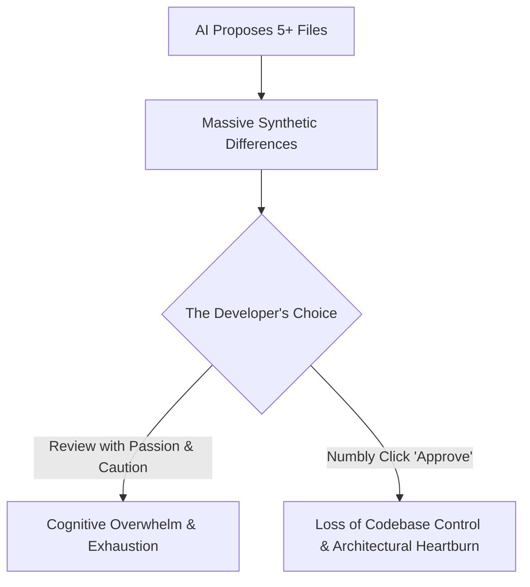

This essay is about a feeling that has been bothering me lately: a growing frustration in my relationship with AI coding assistants. It explores what happened to my code quality, my design, and my satisfaction when I let a machine do the coding. 

To see this clearly, we will look at two compiler-like projects: one where AI was heavily involved in writing the code, and one where the AI was kept strictly at the periphery.

---

### The Genesis: Handcrafting a Transpiler

The story begins with a new project: building a transpiler from **[UniBasic](https://www.unibasic.com/)** to structured, modern **Java**. A transpiler is simply a source-to-source compiler. In this case, it takes the code written in legacy UniBasic and translates it directly into equivalent Java source code. 

Since this was a complex project, I designed and built the core engine entirely by hand, phase by phase:

```
[UniBasic Source] ──> [Lexer] ──> [Parser] ──> [AST] ──> [Transformer] ──> [Emitter] ──> [Java Code]
```

1. **The Lexer:** Tokenizing the legacy UniBasic source files, converting raw characters into a clean stream of syntactical tokens while handling legacy peculiarities.
2. **The Parser:** Implementing a hand-written hybrid parser, combining **recursive descent** for statements and declarations with a **Pratt parser** (top-down operator precedence) to elegantly handle operator precedence and associativity in complex expressions.
3. **The AST (Abstract Syntax Tree):** Designing the strongly-typed in-memory representation of the source code structure, capturing variable declarations, subroutines, loops, and expressions.
4. **The Transformer:** Performing the core translation work, serving two critical purposes:
   * **Vocabulary Mapping:** Translating legacy UniBasic keywords and built-in operations into Java standard library or custom runtime library equivalents.
   * **AST-to-AST Mapping:** Re-architecting code structures. For example, translating the legacy, multi-value string search command `LOCATE` into a structured series of conditional `If/Else` nodes inside the target Java AST.
5. **The Emitter:** Traversing the transformed AST to generate clean, readable, and compilable target Java classes.

Building this foundation by hand was incredibly satisfying. Every part was clean and easy to understand. When the code compiled and generated its first working Java class, I felt in complete control. I understood every line of code and every design choice.

---

### The Slippery Slope: Inviting the AI Assistant

With the solid, handcrafted foundation in place, the core transpiler pipeline was running smoothly. That was when I decided to use AI to gain speed. 

It started well. The AI was fast at generating simple code and repetitive boilerplates. But as the tasks grew harder, our relationship changed.

The real friction began when we decided to introduce **Type Inference**. 

UniBasic has dynamic types, while Java is statically typed. To generate clean Java, the transpiler had to figure out types based on context. This required a type-resolution engine. 

Instead of helping me design a clean engine, the AI suggested massive, complicated changes across the whole project. To fix type bugs, the AI injected type logic everywhere, in the parser, AST nodes, and helper files. Instead of keeping type inference in one clean phase, the AI created a mess. 

To save the project's design, I had to take back control. I ignored the AI's plans, designed the logic myself, and built it using small commits. I kept the type logic in one place. (Even though there were multiple passes at type-inference).

---

### The Explainer's Tax: Coding in English

As the project grew, I noticed a new problem: **explaining how to build a small piece of functionality to the AI, and doing it multiple times in English, was too draining.** 

For example, legacy UniBasic uses unstructured jumps (`GOSUB` and `GOTO`), while Java relies on structured method calls and loops. To convert these unstructured jumps to structured Java, I designed a clear translation strategy:
* GOSUB always maps to a local private method in Java
* If the extracted label body contains a `GOTO` statement pointing to the same label, it represents a loop, which we transform into a **while loop** inside that local private method.

To implement this, the parser needs to track scopes and transform nodes at the right time. 

The AI could not figure out how to build this transformation. I had to write long explanations in English, describing exactly how the parser should track scopes and rewrite the nodes. 

This is **the Explainer’s Tax**. While the tool might technically save us some physical typing time, it leaves us mentally drained. Worse, the code structure is incredibly fragile: even a slight change in the wording of a prompt can cause the AI to generate a completely different architecture, breaking the consistency of the system.

---

### The Review Paradox: The Death of Passion and Caution

When I asked the AI to resolve a bug, it suggested complicated changes that touched many files. Even if it only changed five files, reviewing the code carefully was exhausting. 

This is **the Review Paradox**: *I could not review the code carefully when I did not write it myself.*




Since I did not write the logic myself, my brain glazed over the massive diffs. I could not review the AI's generated code with the same care and caution that I bring to my own. 

Instead of careful auditing, I felt like I was sliding into a mindless loop: *Review plan -> Apply changes -> Run tests -> Feed errors to AI -> Apply fix -> Repeat.* 

Even though I was in control of the design, I lost the satisfaction of coding. Programming felt like a boring administrative job.

> To be fair, the AI helped for sure. It gave me incredible speed. Once the code emission phase was done, the AI was brilliant at analyzing compilation errors in the generated files and tracking down their root causes. But despite that help, there was a constant feeling of void. Normally, when I solve a bug myself, I get a much deeper understanding of the various edge cases I originally missed. The struggle forces me to think about refactoring or redesigning parts of the system. But when the AI solves the bug, I am relegated to a mere reviewer. No matter how passionately I try to review its work, I am gradually moving further away from my own system and my own design.

This frustration reached a peak during a session where we were trying to transpile a new subroutine. The code transpiled successfully, but it pulled in a chain of missing dependencies that weren't included in our parser's file closure. When we compiled the generated Java code, it produced a wall of new compilation errors. 

Rather than helping me surgically expand the scope of files or resolve the missing dependencies, the AI proposed a staggering solution: **let's revert the changes, delete the newly generated Java class, and accept a known gap in the system, because the previous error count was "cleaner"!** 

The AI literally asked me: *“The 22 errors we had were cleaner. Want me to revert back to the previous state?”* 

This is the ultimate corporate check-box trap. The tool didn't want to solve the problem; it just wanted to keep the error dashboard looking neat, even if it meant deleting actual progress.

---

### The Superpower of Thinking Small

In another session, the AI’s inability to "think small" wasted time. We were transpiling a legacy source file that contained several `GOSUB` statements. I noticed that the output Java file was completely missing the private methods that should have been generated for these labels. 

The source file looked perfectly ordinary. The AI started debugging, building massive, complex hypotheses, and spinning its wheels. After watching it generate long paragraphs of theory, I interrupted it and asked it to write a unit test for that specific file. The test failed. 

Now we knew there was a parser failure, but the file was huge, around 1,200 lines long. The test failure didn't tell us *which* line or fragment was causing the problem. The AI immediately restarted its winding, high-level analysis, trying to guess what was wrong across those 1,200 lines. 

I had to step in and give another instruction: **trim down the file to small fragments, run the test on each fragment, and pause on the very first failure.** 

We found the bug immediately. A legacy UniBasic `ELSE` block had its body on the exact same line as the `IF` statement. Because we had built our parser without a formal grammar, no formal UniBasic grammar is publicly available, such parsing failures were expected. But finding it required a classic, systematic debugging technique.

This was a major realization: **thinking small is one of the most undervalued attributes in software engineering.** AI tools do not naturally think small. They try to swallow a 1,200-line problem all at once, generating sprawling theories and sweeping guesses. It takes an ordinary human mind to enforce discipline, break the problem into tiny pieces, and isolate the bug.

---

### Rogue Agents and the Deleted Stubs

It felt like I had lost control of my workspace. 

We had created a dedicated folder for the transpiled Java code and several local runtime library stubs. The generated Java code depended on a runtime library to function, and these stubs were a mock implementation of that library so we could compile the transpiled code locally. Since these were work-in-progress stubs, I decided to push them to Git only after fixing all compilation errors. In hindsight, this was my mistake too, I should have committed them, perhaps excluding them from the build, to keep them safe.

While we were analyzing Java compilation errors, the AI agent scanned the workspace and silently deleted the stubs. 

I pointed this out, and the AI scanned the transpiled code to regenerate them. But as we continued fixing errors, the AI scanned the workspace again and deleted the stubs a second time. 

This was the turning point. Realizing that the AI was stuck in a loop and deleting my work was deeply frustrating. We spent 30-odd minutes fixing bugs caused by the tool itself, not by our compiler logic.

---

### The Breaking Point: The Erosion of Understanding

By the time the transpiler generated compilable Java code, I looked at what we had done. On paper, it worked. But in reality, something important was missing. 

I had reached a breaking point due to four realizations:

1. **No Satisfaction:** For me, the joy of programming comes from building things yourself. Because the AI generated so much of the code, the final success felt hollow.
2. **Constant Frustration:** Instead of enjoying the creative flow of coding, I spent my time correcting the AI's complex plans and explaining compiler concepts in prose.
3. **Exhausting Reviews:** Reviewing large, generated diffs felt like grading homework. It took all the fun out of the project. Even when we did small commits and I tried to review each one with passion, the AI churned them out too fast. There were simply too many changes in a short-span of time. In that rapid-fire stream, I lost track of what I had actually achieved. My mental map of the system's evolution began to blur, which was mentally exhausting.
4. **Losing System Intimacy:** Because reviewing sprawling code was so exhausting, it was harder to keep that close, line-by-line connection to my own work. The clean mental model of my handcrafted parser was cluttered by the complicated type logic generated by the AI.

It felt like I had created a distance between myself and my code, which affected my deep understanding of the system. Worse, I felt like my ability to think deeply was reducing. It might sound like an exaggeration, but I had a distinct feeling that my own cognitive gears were slowing down, as if outsourcing so much of the day-to-day thinking was gradually dulling my engineering instincts.

---

### The Danger of Chasing Pure Speed

This cognitive drag happens because the industry has made speed our only engineering metric. We live in an era of executive hype, where CEOs boast that “65-75% of our code is now written by AI,” promising that teams can deliver features in minutes and finish massive user stories in a single day. 

But when speed is the only goal, we might end up building teams that specialize in nothing but hitting *Enter*. If a company forces a team to build a complex transpiler in just two months, the AI will own the codebase, not the developers. We breed developers who have zero intimate knowledge of the systems they supposedly write. The result is a codebase that might pass CI, but is far too complex, bloated, and unreviewable for any human to safely maintain.

This is the core danger: **AI addiction is actually a decision-making addiction.** 

When we say AI is writing most of our code, what we really mean is that the AI is making most of our decisions. It decides what architectural path to take based purely on what it "feels" is right, bypassing the subtle design tradeoffs that define software craftsmanship. 

For example, consider how we parsed legacy UniBasic target labels:

```
GOSUB L1 *L1 is the label here.

L1: *
  its body
```

If I had let the AI write the logic, it would have injected complex lookaheads directly into the parser. Instead, I decided to handle this in the **lexer**. The lexer identified label tokens early, making the parser's job simple: it just had to look for a `Label` token, capture it, and associate it with its body later. 

That single decision kept the parser simple (we could live with 1-lookahead token). It made me realize that outsourcing the code often means outsourcing the thinking. We risk raising a generation of developers who might never make design choices. They might never wrestle with questions like: *Should a GOSUB label be handled by the lexer or the parser?* or *Does moving it to the lexer simplify my parser?* 

Delegating these decisions to an AI might speed up the typing, but the cost is high: we are outsourcing the actual thinking. 

---

### Finding the Right Boundary

I want to be clear: I am not saying I will banish AI completely. That is not realistic, nor is it what I want. But creating the right boundary has become essential for my survival (and my Blood Pressure!).

I cannot afford to lose my engineering instincts. I do not want to feel frustrated at the end of the day, having won a hollow victory by asking a machine to write my logic. The distance between myself and my code, and therefore my actual understanding of the systems I build, cannot increase. 

So, how do we draw this boundary? I am still trying to figure it out, but for me, the path forward comes through two steps: establishing a disciplined set of rules for my daily work, and running a clean, handcrafted side-project.

---

### The Rebellion: Reclaiming the Craft with "Slow Code"

Exhausted by this process, I decided to run an experiment. I started a side project (which is currently work in progress) called [**`infer`**](https://github.com/SarthakMakhija/infer), an educational compiler project in Rust, designed to implement constraint-based type inference from scratch for a toy language.

For this project, I made a rule: **no AI in the driver's seat.**

> To be clear, I did not ban AI completely. I still use it to review my code, critique my tests, discuss designs, and generate comments. The AI is a great sounding board. But it does not write the code. The physical act of writing the code remains mine alone.

The difference was immediate. The speed is slow, but the pacing of hand-written Rust is peaceful. In files like [`declaration.rs`](https://github.com/SarthakMakhija/infer/blob/main/src/parser/declaration.rs), parsing a variable declaration is done in a few clean lines:

```rust
pub(crate) fn parse(&mut self) -> Result<Statement, ParseError> {
    self.stream.expect(TokenType::Var)?;
    let name = self.stream.expect_identifier()?;
    let data_type = self.maybe_datatype()?;
    let expression = self.maybe_expression()?;
    self.stream.expect(TokenType::Semicolon)?;

    Ok(Statement::variable_declaration(VariableDeclaration::new(
        name.owned_value(),
        data_type,
        expression,
    )))
}
```

Every method, error, and test is a conscious choice. When the parser works, the victory is mine. The pace is slow, but **the satisfaction is huge**. I am not auditing a machine's messy code; I am building a system line by line.

---

### My Rules for Surviving in the Age of AI-Assisted Coding

How do I survive in the age of AI-assisted coding without losing my sanity or my skills? I am trying to establish pragmatic set of boundaries which work for me. Everyone will have their own personal realizations, but these are the rules I am trying to live by:

#### 1. I cap the "Explainer's Tax" at 15 minutes
If explaining a problem to the AI and reviewing its sprawling multi-file plan takes me more than 15 minutes, **I avoid using the AI for that use case entirely**. I close the chat/terminal, open a blank buffer, and write the logic by hand. I build the code myself, write it cleaner, and retain a robust mental model of the system.

#### 2. I centralize foundations first
Even with AI, small commits are mandatory. However, the complexity of those commits must be actively audited. What is considered "complex" is deeply personal and subjective. But over time, I have developed a gut instinct to gauge the true complexity of a topic before I start writing code. For complex features like type inference, I now enforce a strict boundary: I prioritize having a detailed architectural conversation with the AI to refine my thinking. I build the foundations by myself first, and **I avoid asking the AI to write the code unless I am 100% confident in the structural foundation I have established.**

#### 3. I outsource monotony, not decisions
Even in my hand-crafted `infer` project <sup>under development, at the time of writing this essay</sup>, I designed and laid out all the foundations, the lexer, the parser, and the `ParserStream`, entirely by hand. However, if building a particular parser becomes repetitive or monotonous, I would ask the AI to generate it. But I enforce a strict safety net: **I will manually write the unit tests first** to cover all edge cases, and then ask the AI to review both the code it wrote and the tests I wrote. The decisions remain mine; only the typing of monotonous boilerplate is delegated.

#### 4. Outside the company, I maintain a "Slow Code" sanctuary
I try to keep an active personal side-project (like [infer](https://github.com/SarthakMakhija/infer)) where AI is strictly kept out of the codebase's driver's seat. I wrestle with the compiler myself, letting my engineering instincts stay active. It refreshes my mind, protects my creativity, and keeps my skills sharp.

---

### Reclaiming the Joy of Software

The joy of programming is found in the friction of the struggle, the elegant solution arrived at after hours of thought, and the physical act of creation. It is found in that exact moment when a compiler error finally vanishes because you understood the system, not because you fed a diff to a stateless agent.

I think, when we outsource the typing, the design, and the thinking, we delegate the joy. The speed isn't worth the cost for me.
